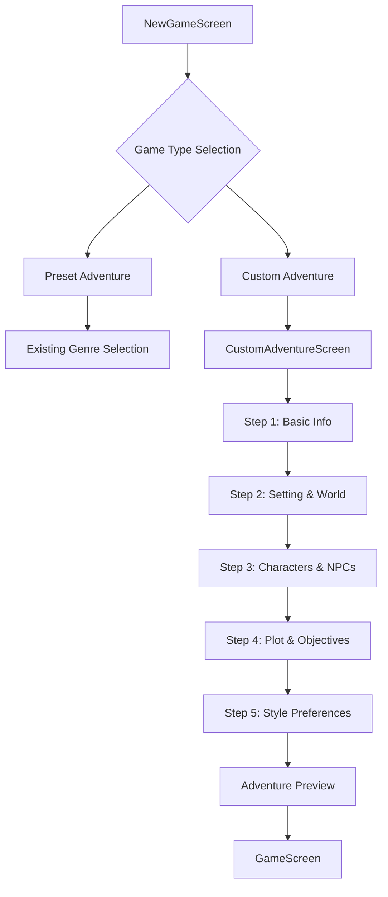
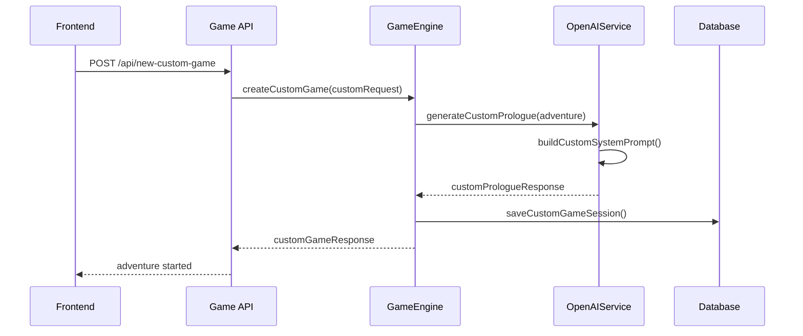
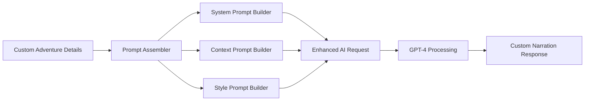
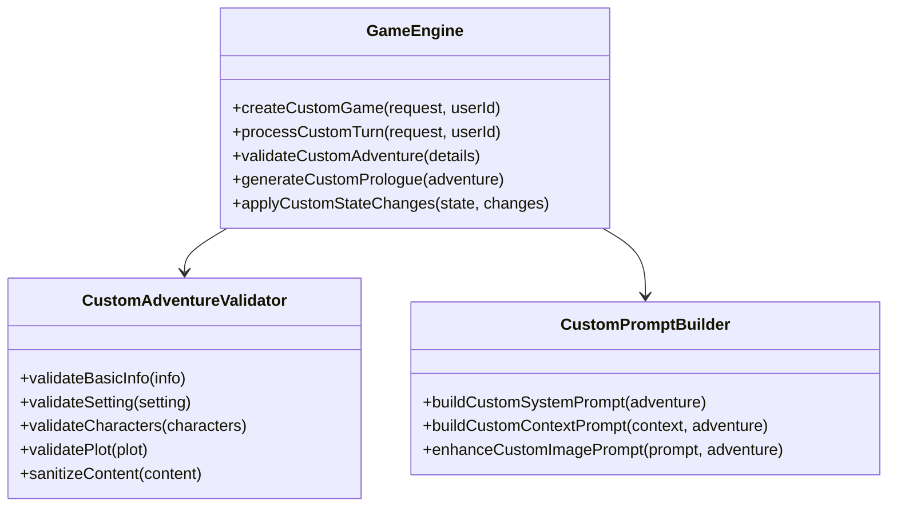
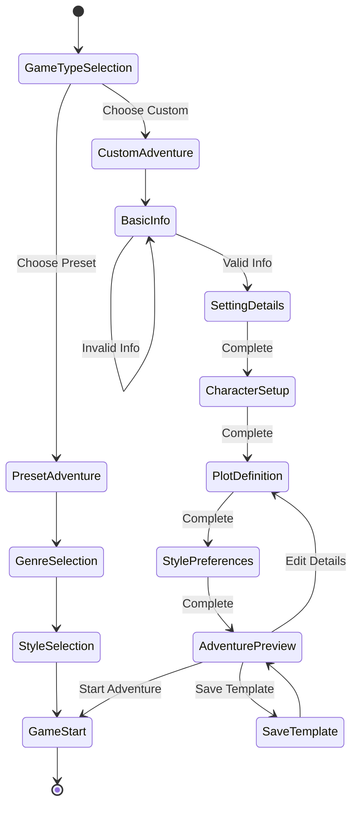
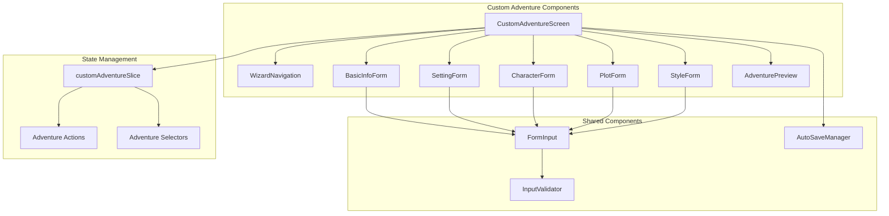

# Custom Adventure Creator Design

## Overview

This feature enables users to describe their own adventure scenarios and have the AI story generator create immersive, personalized experiences based on their descriptions. Users can define custom settings, characters, plots, and themes that the AI will use as the foundation for dynamic storytelling.

## Architecture

### Frontend Components

#### Custom Adventure Screen
A new screen that allows users to input their adventure details through a multi-step form interface.



#### Adventure Creation Flow

**Step 1: Basic Information**
- Adventure title (required)
- Genre selection (fantasy, sci-fi, horror, modern, custom)
- Content rating preferences
- Estimated adventure length

**Step 2: Setting & World**
- Primary location/world description
- Time period/era
- Environmental details
- Special rules or physics

**Step 3: Characters & NPCs**
- Player character description/role
- Key NPCs and their relationships
- Antagonists and allies
- Character motivations

**Step 4: Plot & Objectives**
- Main quest/objective
- Secondary goals
- Potential plot twists
- Victory/failure conditions

**Step 5: Style & Technical Preferences**
- Narration style (detailed/concise)
- Image generation style
- Tone preferences (serious/humorous/dramatic)
- Content filters

### Backend API Extensions

#### New API Endpoints



#### Custom Game Request Schema

```typescript
interface CustomAdventureRequest extends NewGameRequest {
  adventure_details: {
    title: string;
    description: string;
    setting: {
      world_description: string;
      time_period: string;
      environment: string;
      special_rules?: string;
    };
    characters: {
      player_role: string;
      key_npcs: Array<{
        name: string;
        description: string;
        relationship: string;
      }>;
    };
    plot: {
      main_objective: string;
      secondary_goals: string[];
      plot_hooks: string[];
      victory_conditions: string;
    };
    style_preferences: {
      tone: 'serious' | 'humorous' | 'dramatic' | 'mixed';
      complexity: 'simple' | 'moderate' | 'complex';
      pacing: 'slow' | 'moderate' | 'fast';
    };
  };
}
```

### AI Integration Enhancements

#### Custom Prompt Engineering

The OpenAI service will be enhanced to handle custom adventures through specialized prompt generation:



#### Enhanced Prompt Structure

**System Prompt Modifications:**
- Incorporate user-defined world rules and setting
- Include character relationship maps
- Embed plot objectives and story direction
- Apply custom tone and style preferences

**Context Management:**
- Maintain consistency with user-defined world rules
- Track custom NPCs and their personalities
- Monitor progress toward user-defined objectives
- Preserve custom setting details across turns

### Data Models

#### Custom Adventure Schema

```typescript
interface CustomAdventure {
  adventure_id: string;
  user_id: string;
  title: string;
  description: string;
  setting: AdventureSetting;
  characters: AdventureCharacters;
  plot: AdventurePlot;
  style_preferences: StylePreferences;
  created_at: Date;
  is_template: boolean;
  usage_count: number;
}

interface AdventureSetting {
  world_description: string;
  time_period: string;
  environment: string;
  special_rules?: string;
  locations: string[];
}

interface AdventureCharacters {
  player_role: string;
  key_npcs: NPC[];
  relationships: Relationship[];
}

interface AdventurePlot {
  main_objective: string;
  secondary_goals: string[];
  plot_hooks: string[];
  victory_conditions: string;
  estimated_turns: number;
}
```

#### Extended Game Session Schema

The existing GameSession model will be extended to support custom adventures:

```typescript
interface CustomGameSession extends GameSession {
  adventure_type: 'preset' | 'custom';
  custom_adventure?: {
    adventure_id: string;
    original_details: CustomAdventureRequest['adventure_details'];
    adaptive_elements: {
      discovered_locations: string[];
      met_npcs: string[];
      completed_objectives: string[];
      story_branches: string[];
    };
  };
}
```

### Game Engine Enhancements

#### Custom Adventure Processing



#### Adventure Template System

Users can save their custom adventures as templates for reuse:

- **Save as Template**: Convert completed adventure setups into reusable templates
- **Template Library**: Browse and use community-shared templates
- **Template Variations**: Modify existing templates with personal touches
- **Template Categories**: Organize templates by genre, complexity, and theme

### User Experience Flow

#### Adventure Creation Wizard



#### Input Validation and Guidance

- **Smart Suggestions**: AI-powered suggestions for incomplete sections
- **Content Guidelines**: Help text and examples for each section
- **Progressive Disclosure**: Show advanced options only when needed
- **Real-time Validation**: Immediate feedback on input quality and completeness

### Technical Implementation

#### Frontend Component Architecture



#### Backend Service Extensions

```typescript
class CustomAdventureService {
  async validateAdventureDetails(details: AdventureDetails): Promise<ValidationResult> {
    // Validate each section of the adventure
    // Check for content appropriateness
    // Ensure AI can work with provided details
  }
  
  async generateAdventureSuggestions(partial: Partial<AdventureDetails>): Promise<Suggestions> {
    // Use AI to suggest missing elements
    // Provide creative inspiration
    // Ensure narrative consistency
  }
  
  async saveAdventureTemplate(adventure: CustomAdventure): Promise<string> {
    // Save reusable adventure template
    // Generate searchable metadata
    // Apply privacy settings
  }
}
```

#### Database Optimization

- **Indexing**: Create indexes for adventure search and filtering
- **Caching**: Cache frequently used adventure templates
- **Compression**: Compress adventure details for storage efficiency
- **Archiving**: Archive old or unused custom adventures

### Testing Strategy

#### Unit Testing
- Form validation logic
- Adventure detail sanitization
- Custom prompt generation
- Template saving/loading

#### Integration Testing
- End-to-end adventure creation flow
- AI response quality with custom prompts
- Game session persistence with custom data
- Template sharing and reuse

#### User Experience Testing
- Adventure creation wizard usability
- Form completion rates
- Time to complete adventure setup
- Quality of generated adventures

### Performance Considerations

#### Frontend Optimization
- **Lazy Loading**: Load wizard steps on demand
- **Auto-save**: Prevent data loss during creation
- **Caching**: Cache form state and suggestions
- **Compression**: Minimize API payload sizes

#### Backend Optimization
- **Prompt Caching**: Cache common prompt components
- **Batch Processing**: Process multiple adventure validations together
- **Rate Limiting**: Prevent abuse of AI suggestion features
- **Connection Pooling**: Optimize database connections for template operations

#### AI Integration Optimization
- **Prompt Optimization**: Minimize token usage while maintaining quality
- **Response Caching**: Cache similar adventure generations
- **Fallback Strategies**: Handle AI service unavailability gracefully
- **Cost Management**: Monitor and control AI API usage costs