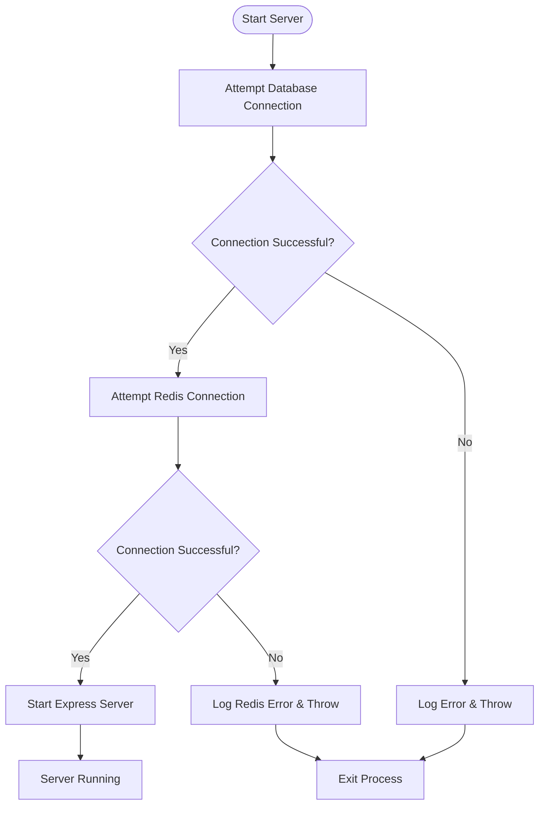

# Backend Troubleshooting Guide

## Overview
This document identifies common issues that prevent the backend from running and provides solutions to resolve them.

## Common Issues and Solutions

### 1. Missing Environment Variables
The backend requires several environment variables to function properly. Check that your `.env` file includes all required variables:

```env
# Database
MONGODB_URI=mongodb://localhost:27017/dungeon-ai
REDIS_URL=redis://localhost:6379

# OpenAI
OPENAI_API_KEY=your_openai_api_key_here

# JWT
JWT_SECRET=your_super_secret_jwt_key_here
JWT_EXPIRES_IN=7d

# Server
PORT=3001
NODE_ENV=development

# CORS
ALLOWED_ORIGINS=http://localhost:3000,http://localhost:19006
```

**Solution**: Copy `.env.example` to `.env` and fill in the required values:
```bash
cd backend
cp .env.example .env
# Edit .env with your values
```

### 2. Database Services Not Running
The backend depends on MongoDB and Redis services. If these aren't running, the backend will fail to start.

**Check MongoDB status**:
```bash
# On macOS with Homebrew
brew services list | grep mongodb

# Start MongoDB if not running
brew services start mongodb-community
```

**Check Redis status**:
```bash
# On macOS with Homebrew
brew services list | grep redis

# Start Redis if not running
brew services start redis
```

**Test connections**:
```bash
# Test MongoDB
mongo --host localhost:27017

# Test Redis
redis-cli ping  # Should return "PONG"
```

### 3. Docker Environment Issues
When running with Docker, ensure all services are healthy:

```bash
# Check service status
docker-compose -f docker-compose.dev.yml ps

# Check logs for specific services
docker logs dungeon-ai-mongo-dev
docker logs dungeon-ai-redis-dev
docker logs dungeon-ai-backend-dev
```

### 4. Port Conflicts
Ensure ports 3001 (backend), 27017 (MongoDB), and 6379 (Redis) are not being used by other applications.

```bash
# Check if ports are in use
lsof -i :3001
lsof -i :27017
lsof -i :6379
```

### 5. Dependency Installation Issues
Ensure all dependencies are properly installed:

```bash
cd backend
npm install
```

### 6. TypeScript Compilation Errors
If there are TypeScript errors, the build will fail:

```bash
cd backend
npm run build
```

Check the output for any compilation errors and fix them before starting the server.

## Diagnostic Steps

### 1. Check Startup Logs
When the backend fails to start, check the logs for specific error messages:

```bash
# For development
npm run dev

# For Docker
docker logs dungeon-ai-backend-dev
```

### 2. Verify Environment Variables
The backend checks for critical environment variables at startup:

```typescript
const requiredEnvVars = ['MONGODB_URI', 'REDIS_URL', 'JWT_SECRET', 'OPENAI_API_KEY'];
const missingEnvVars = requiredEnvVars.filter((name) => !process.env[name]);
if (missingEnvVars.length > 0) {
  missingEnvVars.forEach((name) => logger.error(`Missing environment variable: ${name}`));
  process.exit(1);
}
```

### 3. Database Connection Issues
The backend attempts to connect to MongoDB and Redis at startup. If either connection fails, the server will exit.

**MongoDB Connection Flow**:


### 4. Common Error Messages

| Error | Cause | Solution |
|-------|-------|----------|
| `Missing environment variable: MONGODB_URI` | Missing `.env` file or variable | Create `.env` file with required variables |
| `Failed to connect to MongoDB` | MongoDB not running or wrong URI | Start MongoDB service or check URI |
| `Failed to connect to Redis` | Redis not running or wrong URI | Start Redis service or check URI |
| `EADDRINUSE: address already in use` | Port 3001 already in use | Kill process using port or change PORT |
| `Error: Cannot find module` | Missing dependencies | Run `npm install` |

## Running the Backend

### Development Mode
```bash
cd backend
npm run dev
```

### Production Mode
```bash
cd backend
npm run build
npm start
```

### Docker Mode
```bash
# Development
docker-compose -f docker-compose.dev.yml up

# Production
docker-compose up
```

## Testing the Backend

Once running, verify the backend is working:

1. Health check: `curl http://localhost:3001/health`
2. API docs: Visit `http://localhost:3001/api/docs`
3. Test API endpoint: `curl http://localhost:3001/api/auth/login`

## Additional Troubleshooting

### Check File Permissions
Ensure the backend has proper permissions to create log files:

```bash
# Create logs directory with proper permissions
mkdir -p backend/logs
chmod 755 backend/logs
```

### Clear Docker Volumes (if needed)
If there are persistent issues with Docker:

```bash
docker-compose -f docker-compose.dev.yml down -v
docker-compose -f docker-compose.dev.yml up
```

### Reset Node Modules
If dependency issues persist:

```bash
cd backend
rm -rf node_modules package-lock.json
npm install
```