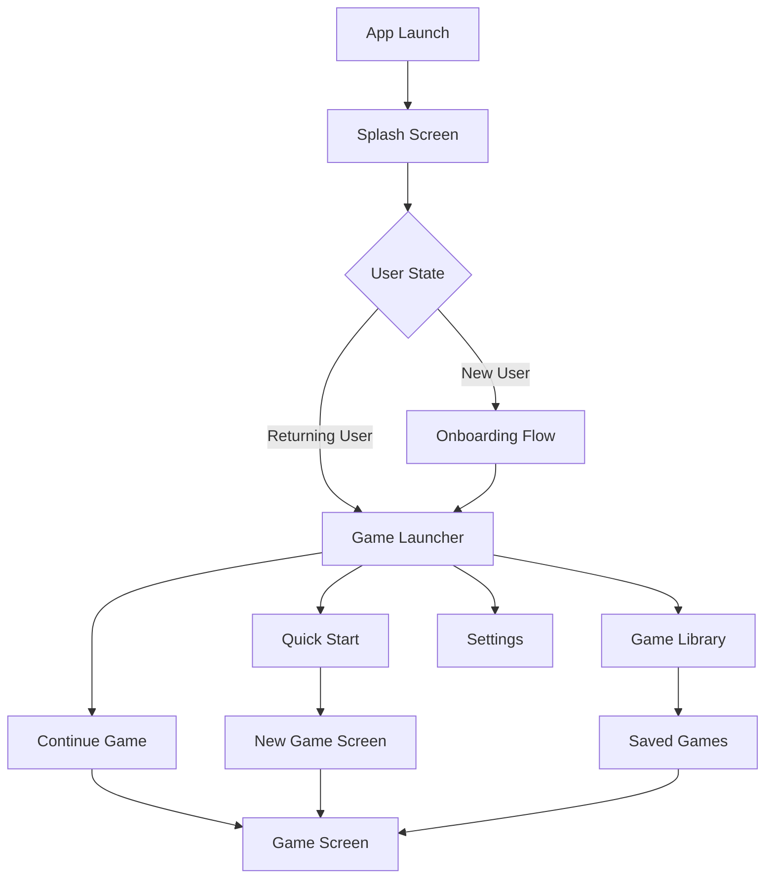
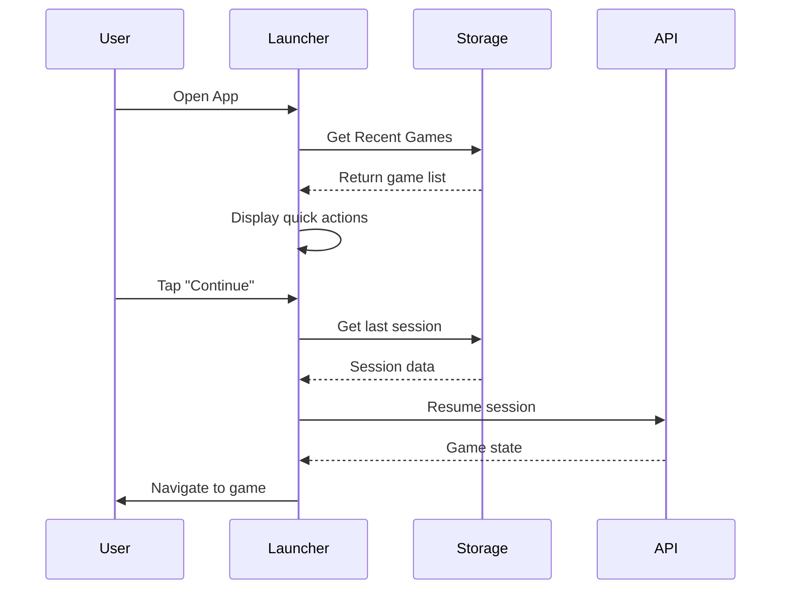

# Phone Game Launcher Enhancement Design

## Overview

This design document outlines the implementation of an improved phone game launcher experience for the AI Dungeon mobile application. The current implementation already uses Expo for cross-platform mobile development, but lacks optimized mobile UX patterns, quick launch features, and native mobile integrations that would enhance the phone gaming experience.

## Technology Stack & Dependencies

- **React Native**: 0.79.6 with Expo SDK 53
- **Expo Router**: For enhanced navigation and deep linking
- **Expo SplashScreen**: Custom branded splash screens
- **Expo Notifications**: Push notifications for game updates
- **Expo SecureStore**: Secure storage for game saves and user preferences
- **AsyncStorage**: Quick access to recent games and settings
- **Expo Haptics**: Tactile feedback for game interactions
- **React Navigation**: Stack and tab navigation
- **Redux Toolkit**: State management with RTK Query

## Component Architecture

### Enhanced Navigation Structure



### Core Components Hierarchy

```
GameLauncherApp/
├── SplashScreen
├── OnboardingFlow/
│   ├── WelcomeSlide
│   ├── GenrePreviewSlide
│   └── NotificationPermissionSlide
├── GameLauncher/
│   ├── QuickActions
│   ├── RecentGames
│   ├── GameLibrary
│   └── UserProfile
├── EnhancedGameScreen/
│   ├── MobileOptimizedChat
│   ├── SwipeableInputBox
│   ├── HapticGameControls
│   └── QuickActionBar
└── Settings/
    ├── NotificationSettings
    ├── HapticSettings
    └── DisplaySettings
```

### Component Definition

#### GameLauncher Component
- **Purpose**: Main hub for game access and management
- **Props**: 
  - `recentGames: GameSession[]`
  - `userPreferences: UserPreferences`
  - `onQuickStart: () => void`
- **State**: Loading states, selected genre filters
- **Features**: Quick game start, recent games carousel, achievement display

#### QuickActions Component
- **Purpose**: One-tap access to common game actions
- **Props**: 
  - `availableActions: QuickAction[]`
  - `onActionPress: (action: string) => void`
- **Features**: Continue last game, start new adventure, load specific save

#### MobileOptimizedChat Component
- **Purpose**: Touch-optimized chat interface with mobile-specific features
- **Props**: 
  - `turns: GameTurn[]`
  - `isLoading: boolean`
  - `onImageTap: (imageUrl: string) => void`
- **Features**: Zoom gestures for images, text-to-speech, copy text functionality

### Component Usage Examples

```typescript
// Quick launcher usage
<GameLauncher
  recentGames={recentGameSessions}
  userPreferences={userSettings}
  onQuickStart={handleQuickStart}
  onContinueGame={handleContinueGame}
  onViewLibrary={handleViewLibrary}
/>

// Enhanced input with haptic feedback
<SwipeableInputBox
  onSubmit={handleSubmitTurn}
  disabled={isProcessing}
  quickActions={availableActions}
  enableHaptics={hapticSettings.enabled}
  onSwipeLeft={handleUndoAction}
  onSwipeRight={handleQuickAction}
/>
```

## Routing & Navigation

### Navigation Structure

```typescript
// Enhanced navigation with deep linking support
const GameStack = createStackNavigator();
const TabNavigator = createBottomTabNavigator();

function GameStackNavigator() {
  return (
    <GameStack.Navigator>
      <GameStack.Screen name="Launcher" component={GameLauncher} />
      <GameStack.Screen name="NewGame" component={NewGameScreen} />
      <GameStack.Screen name="Game" component={EnhancedGameScreen} />
      <GameStack.Screen name="SavedGames" component={GameLibrary} />
    </GameStack.Navigator>
  );
}

function MainTabNavigator() {
  return (
    <TabNavigator.Navigator>
      <TabNavigator.Screen 
        name="Games" 
        component={GameStackNavigator}
        options={{
          tabBarIcon: ({ color }) => <Ionicons name="game-controller" color={color} />,
        }}
      />
      <TabNavigator.Screen 
        name="Library" 
        component={GameLibrary}
        options={{
          tabBarIcon: ({ color }) => <Ionicons name="library" color={color} />,
        }}
      />
      <TabNavigator.Screen 
        name="Settings" 
        component={Settings}
        options={{
          tabBarIcon: ({ color }) => <Ionicons name="settings" color={color} />,
        }}
      />
    </TabNavigator.Navigator>
  );
}
```

### Deep Linking Configuration

```typescript
// URL schemes for deep linking
const linking = {
  prefixes: ['aidungeon://', 'https://aidungeon.app'],
  config: {
    screens: {
      Launcher: 'launcher',
      Game: 'game/:sessionId',
      NewGame: 'new-game/:genre?',
      SavedGames: 'library',
    },
  },
};
```

## Mobile-Optimized Features

### Quick Launch System



### Haptic Feedback Integration

- **Turn Submission**: Light impact feedback on successful turn
- **Quick Actions**: Selection feedback on button press
- **Error States**: Warning haptic on failed actions
- **Critical Events**: Heavy impact for major story moments

### Offline Capabilities

- **Game Save Caching**: Store recent game states locally
- **Text-Only Mode**: Continue playing without images when offline
- **Queue Actions**: Queue player inputs when connection is poor
- **Smart Sync**: Background synchronization when connection restored

## Styling Strategy

### Mobile-First Design System

```typescript
// Responsive spacing system
const spacing = {
  xs: 4,
  sm: 8,
  md: 16,
  lg: 24,
  xl: 32,
  xxl: 48,
};

// Touch-optimized sizing
const touchTargets = {
  minimum: 44, // iOS minimum
  comfortable: 56, // Material Design recommended
  large: 72, // Easy one-handed use
};

// Adaptive typography
const typography = {
  display: {
    fontSize: 32,
    lineHeight: 40,
    fontWeight: '700',
  },
  headline: {
    fontSize: 24,
    lineHeight: 32,
    fontWeight: '600',
  },
  body: {
    fontSize: 16,
    lineHeight: 24,
    fontWeight: '400',
  },
  caption: {
    fontSize: 14,
    lineHeight: 20,
    fontWeight: '400',
  },
};
```

### Dark Mode Optimization

```typescript
// Enhanced dark theme for mobile viewing
const darkTheme = {
  primary: '#8b5cf6',
  secondary: '#06d6a0',
  background: '#0f0f0f',
  surface: '#1a1a1a',
  surfaceVariant: '#2a2a2a',
  text: '#f3f4f6',
  textSecondary: '#9ca3af',
  accent: '#10b981',
  error: '#ef4444',
  warning: '#f59e0b',
};
```

## State Management

### Enhanced Game State

```typescript
interface EnhancedGameState {
  // Existing state
  currentSession: GameSession | null;
  isLoading: boolean;
  error: string | null;
  
  // New mobile-specific state
  recentGames: GameSession[];
  quickActions: QuickAction[];
  offlineQueue: PendingAction[];
  hapticSettings: HapticPreferences;
  displaySettings: DisplayPreferences;
  notificationSettings: NotificationPreferences;
}

// New slices for mobile features
const launcherSlice = createSlice({
  name: 'launcher',
  initialState: {
    recentGames: [],
    favoriteGenres: [],
    quickStartEnabled: true,
    lastPlayedSession: null,
  },
  reducers: {
    addToRecentGames: (state, action) => {
      const game = action.payload;
      state.recentGames = [game, ...state.recentGames.filter(g => g.session_id !== game.session_id)].slice(0, 5);
    },
    setLastPlayed: (state, action) => {
      state.lastPlayedSession = action.payload;
    },
  },
});
```

### Offline State Management

```typescript
const offlineSlice = createSlice({
  name: 'offline',
  initialState: {
    isOnline: true,
    queuedActions: [],
    cachedGames: {},
    syncStatus: 'idle',
  },
  reducers: {
    setOnlineStatus: (state, action) => {
      state.isOnline = action.payload;
    },
    queueAction: (state, action) => {
      state.queuedActions.push({
        ...action.payload,
        timestamp: Date.now(),
      });
    },
    syncSuccess: (state) => {
      state.queuedActions = [];
      state.syncStatus = 'success';
    },
  },
});
```

## API Integration Layer

### Enhanced Game API

```typescript
// Extended API service with mobile optimizations
const enhancedGameApi = gameApi.injectEndpoints({
  endpoints: (builder) => ({
    // Quick start endpoint for one-tap game creation
    quickStartGame: builder.mutation<GameSession, QuickStartRequest>({
      query: (preferences) => ({
        url: '/game/quick-start',
        method: 'POST',
        body: preferences,
      }),
    }),
    
    // Get recent games for launcher
    getRecentGames: builder.query<GameSession[], { limit?: number }>({
      query: ({ limit = 5 }) => `/game/recent?limit=${limit}`,
    }),
    
    // Batch sync for offline mode
    syncOfflineActions: builder.mutation<SyncResponse, OfflineAction[]>({
      query: (actions) => ({
        url: '/game/sync',
        method: 'POST',
        body: { actions },
      }),
    }),
    
    // Mobile-optimized image loading
    getOptimizedImage: builder.query<string, { imageUrl: string; size: 'thumb' | 'medium' | 'full' }>({
      query: ({ imageUrl, size }) => `/images/optimize?url=${encodeURIComponent(imageUrl)}&size=${size}`,
    }),
  }),
});
```

### Network State Management

```typescript
// Network-aware API behavior
const networkAwareApi = createApi({
  baseQuery: fetchBaseQuery({
    baseUrl: '/api',
    prepareHeaders: (headers, { getState }) => {
      const token = (getState() as RootState).auth.token;
      if (token) {
        headers.set('authorization', `Bearer ${token}`);
      }
      return headers;
    },
  }),
  tagTypes: ['Game', 'User', 'Offline'],
  endpoints: (builder) => ({}),
});

// Retry configuration for mobile networks
const retryConfig = {
  maxRetries: 3,
  retryDelay: (attempt: number) => Math.min(1000 * 2 ** attempt, 30000),
  retryCondition: (error: any) => {
    return error.status >= 500 || error.status === 'NETWORK_ERROR';
  },
};
```

## Testing Strategy

### Mobile-Specific Testing

```typescript
// Component testing with mobile considerations
describe('GameLauncher', () => {
  it('should display quick actions for touch interaction', () => {
    render(<GameLauncher recentGames={mockGames} />);
    
    // Test touch target sizes
    const quickStartButton = screen.getByTestId('quick-start-button');
    expect(quickStartButton).toHaveStyle({ minHeight: 44 });
  });
  
  it('should handle haptic feedback on actions', async () => {
    const mockHaptics = jest.spyOn(Haptics, 'impactAsync');
    render(<GameLauncher enableHaptics={true} />);
    
    fireEvent.press(screen.getByTestId('quick-start-button'));
    expect(mockHaptics).toHaveBeenCalledWith(Haptics.ImpactFeedbackStyle.Light);
  });
});

// Integration testing for offline mode
describe('Offline Mode', () => {
  it('should queue actions when offline', async () => {
    // Mock network state
    jest.spyOn(NetInfo, 'fetch').mockResolvedValue({
      isConnected: false,
      isInternetReachable: false,
    });
    
    const { store } = renderWithProviders(<GameScreen />);
    
    // Simulate player input while offline
    fireEvent.changeText(screen.getByTestId('input-box'), 'Look around');
    fireEvent.press(screen.getByTestId('submit-button'));
    
    // Verify action was queued
    const state = store.getState();
    expect(state.offline.queuedActions).toHaveLength(1);
  });
});
```

### Performance Testing

```typescript
// Mobile performance testing
describe('Performance', () => {
  it('should render game launcher within performance budget', async () => {
    const startTime = performance.now();
    
    render(<GameLauncher recentGames={largeGamesList} />);
    await waitFor(() => {
      expect(screen.getByTestId('game-launcher')).toBeInTheDocument();
    });
    
    const endTime = performance.now();
    expect(endTime - startTime).toBeLessThan(500); // 500ms budget
  });
  
  it('should handle large chat history efficiently', () => {
    const largeChatHistory = generateMockTurns(100);
    
    render(<MobileOptimizedChat turns={largeChatHistory} />);
    
    // Should only render visible items (virtualization)
    const renderedItems = screen.getAllByTestId(/^chat-turn-/);
    expect(renderedItems.length).toBeLessThanOrEqual(10);
  });
});
```

### Device Testing Matrix

| Device Category | Screen Size | Test Focus |
|----------------|-------------|------------|
| **Small Phone** | 320-375px | Touch targets, text readability |
| **Large Phone** | 375-428px | Optimal layout, thumb reachability |
| **Tablet** | 768px+ | Adaptive layout, multi-column |
| **Foldable** | Variable | Responsive behavior, orientation |

## Implementation Features

### 1. Enhanced Splash Screen Experience

```typescript
// Animated splash with game preview
const AnimatedSplashScreen = () => {
  const [isReady, setIsReady] = useState(false);
  const [showPreview, setShowPreview] = useState(false);
  
  useEffect(() => {
    const prepareLaunch = async () => {
      // Preload critical data
      await Promise.all([
        preloadRecentGames(),
        preloadUserPreferences(),
        preloadAssets(),
      ]);
      
      setIsReady(true);
      
      // Show genre preview if new user
      if (isNewUser) {
        setShowPreview(true);
      }
    };
    
    prepareLaunch();
  }, []);
  
  return (
    <SplashScreen
      isReady={isReady}
      showPreview={showPreview}
      onComplete={handleSplashComplete}
    />
  );
};
```

### 2. One-Tap Quick Start

```typescript
// Intelligent quick start based on user history
const QuickStartButton = ({ userPreferences, recentGames }) => {
  const [quickStart] = useQuickStartGameMutation();
  
  const handleQuickStart = async () => {
    // Haptic feedback
    await Haptics.impactAsync(Haptics.ImpactFeedbackStyle.Medium);
    
    // Determine optimal game settings
    const settings = deriveOptimalSettings(userPreferences, recentGames);
    
    try {
      const result = await quickStart(settings).unwrap();
      navigation.navigate('Game', { sessionId: result.session_id });
    } catch (error) {
      await Haptics.notificationAsync(Haptics.NotificationFeedbackType.Error);
      showErrorAlert(error.message);
    }
  };
  
  return (
    <TouchableOpacity
      style={styles.quickStartButton}
      onPress={handleQuickStart}
      activeOpacity={0.8}
    >
      <LinearGradient
        colors={['#8b5cf6', '#06d6a0']}
        style={styles.gradient}
      >
        <Ionicons name="flash" size={24} color="white" />
        <Text style={styles.buttonText}>Quick Adventure</Text>
      </LinearGradient>
    </TouchableOpacity>
  );
};
```

### 3. Swipe Gestures for Game Controls

```typescript
// Enhanced input with gesture support
const SwipeableInputBox = ({ onSubmit, onUndo, onQuickAction }) => {
  const panGesture = Gesture.Pan()
    .onEnd((event) => {
      const { translationX, velocityX } = event;
      
      if (translationX > 100 && velocityX > 500) {
        // Swipe right - quick action
        Haptics.impactAsync(Haptics.ImpactFeedbackStyle.Light);
        onQuickAction();
      } else if (translationX < -100 && velocityX < -500) {
        // Swipe left - undo
        Haptics.impactAsync(Haptics.ImpactFeedbackStyle.Medium);
        onUndo();
      }
    });
  
  return (
    <GestureDetector gesture={panGesture}>
      <View style={styles.inputContainer}>
        <TextInput
          style={styles.input}
          onSubmitEditing={onSubmit}
          placeholder="What do you do?"
          multiline
        />
        <TouchableOpacity onPress={onSubmit} style={styles.submitButton}>
          <Ionicons name="send" size={20} color="white" />
        </TouchableOpacity>
      </View>
    </GestureDetector>
  );
};
```

### 4. Intelligent Caching System

```typescript
// Smart caching for offline play
const CacheManager = {
  async cacheGameSession(session: GameSession) {
    const cacheKey = `game_${session.session_id}`;
    const cacheData = {
      session,
      timestamp: Date.now(),
      images: await this.cacheImages(session.turn_history),
    };
    
    await AsyncStorage.setItem(cacheKey, JSON.stringify(cacheData));
  },
  
  async getCachedSession(sessionId: string): Promise<GameSession | null> {
    const cacheKey = `game_${sessionId}`;
    const cached = await AsyncStorage.getItem(cacheKey);
    
    if (cached) {
      const data = JSON.parse(cached);
      // Check if cache is still valid (24 hours)
      if (Date.now() - data.timestamp < 24 * 60 * 60 * 1000) {
        return data.session;
      }
    }
    
    return null;
  },
  
  async cacheImages(turns: GameTurn[]): Promise<string[]> {
    const imageUrls = turns
      .map(turn => turn.image_url)
      .filter(Boolean);
    
    // Cache images to device storage
    return await Promise.all(
      imageUrls.map(url => FileSystem.downloadAsync(url, this.getImagePath(url)))
    );
  },
};
```

This enhanced phone game launcher design provides a comprehensive mobile-first experience while building upon the existing Expo infrastructure. The implementation focuses on quick access, offline capabilities, and mobile-optimized interactions that make the AI Dungeon game feel native to mobile devices.