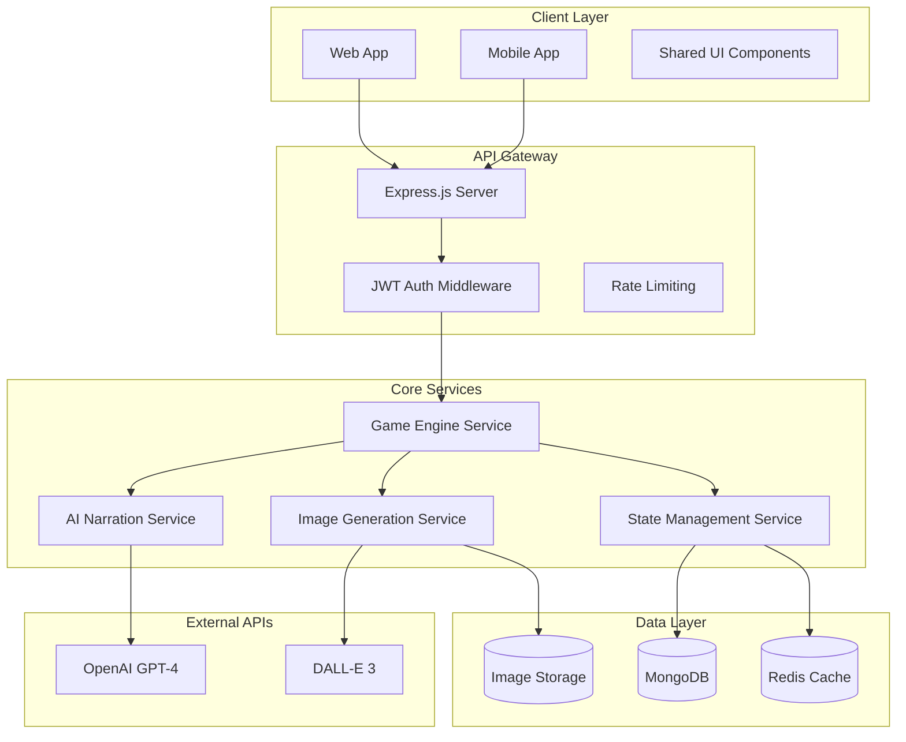
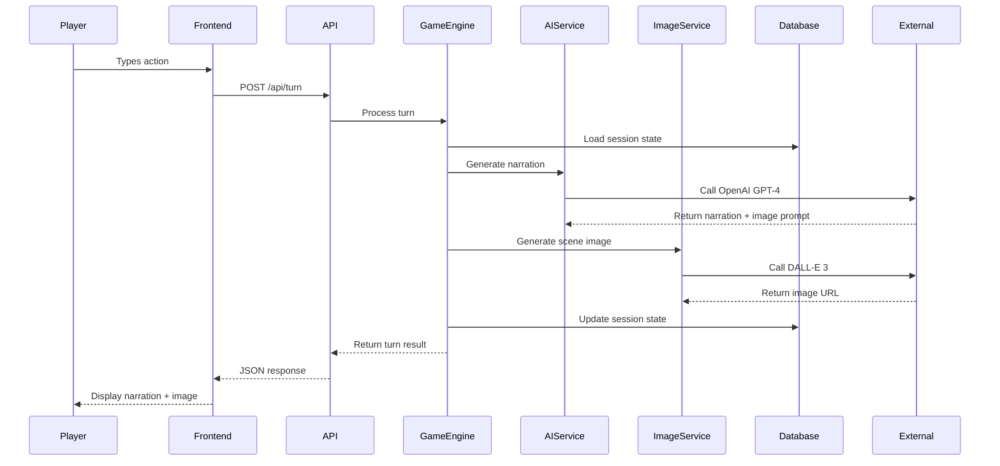
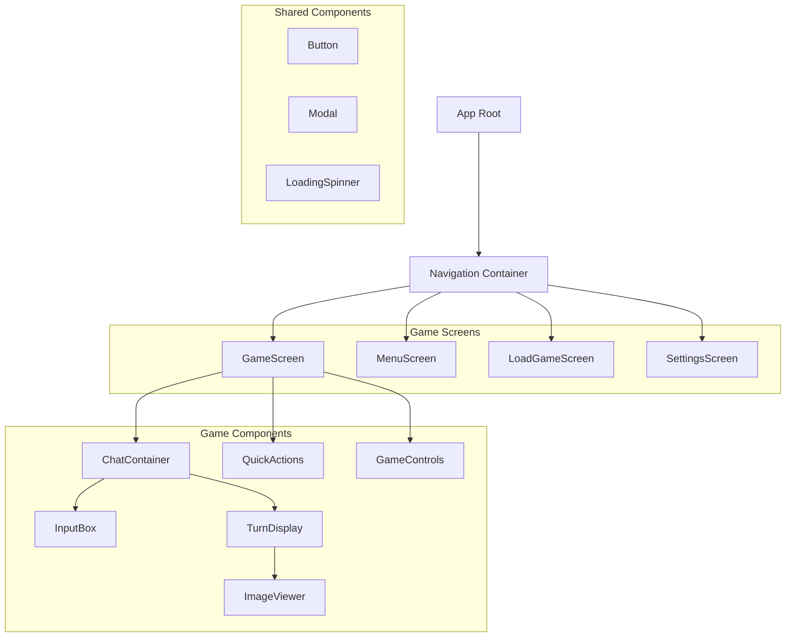
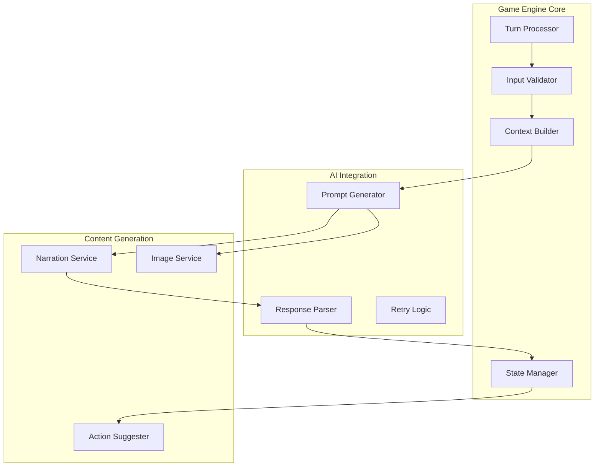
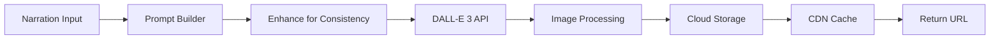

# Dungeon AI Adventure - Text Adventure Game Design

## Overview

A web and mobile-friendly text adventure application that combines AI-driven storytelling with procedural image generation. Players interact through natural language input, receiving immersive narration and visual scene illustrations for each turn. The system maintains world consistency while providing a Dungeon Master-like experience similar to Dungeon AI.

### Core Features
- Freeform text input with AI interpretation
- Rich second-person narration 
- AI-generated scene illustrations
- Persistent world state and game sessions
- Chat-style interface with save/load functionality
- Multi-platform support (web + mobile)

## Technology Stack & Dependencies

### Frontend Stack
- **Framework**: React Native (for cross-platform web/mobile)
- **UI Components**: React Native Elements or NativeBase
- **State Management**: Redux Toolkit with RTK Query
- **Navigation**: React Navigation
- **Styling**: Styled Components or React Native StyleSheet
- **HTTP Client**: Axios integrated with RTK Query

### Backend Stack
- **Runtime**: Node.js
- **Framework**: Express.js
- **Database**: MongoDB with Mongoose ODM
- **Session Management**: Redis for session storage
- **AI Services**: OpenAI API (GPT-4 + DALL-E 3)
- **Authentication**: JWT tokens
- **File Storage**: AWS S3 or Cloudinary for images

### Development Tools
- **API Documentation**: Swagger/OpenAPI
- **Testing**: Jest, React Native Testing Library
- **Build**: Metro bundler, Webpack
- **Deployment**: Docker containers

## Architecture

### System Architecture Diagram



### Data Flow Architecture



## Frontend Architecture

### Component Hierarchy



### Component Specifications

#### GameScreen Component
- **Purpose**: Main game interface container
- **State**: Current session, loading states, error handling
- **Props**: Navigation props
- **Lifecycle**: Initialize game session on mount

#### ChatContainer Component  
- **Purpose**: Scrollable list of game turns
- **State**: Turn history, auto-scroll behavior
- **Props**: Session data, turn array
- **Features**: Virtual scrolling for performance

#### TurnDisplay Component
- **Purpose**: Individual turn rendering (narration + image)
- **Props**: Turn data (narration, image_url, timestamp)
- **Features**: Image lazy loading, text animation
- **Layout**: Card-based design with responsive image sizing

#### InputBox Component
- **Purpose**: Player input interface
- **State**: Current input text, submission state
- **Features**: Auto-complete suggestions, input validation
- **Events**: onSubmit, onChange, onFocus

### State Management Strategy

#### Redux Store Structure
```typescript
interface GameState {
  currentSession: {
    session_id: string;
    world_state: WorldState;
    turn_history: Turn[];
    quick_actions: string[];
  };
  ui: {
    isLoading: boolean;
    error: string | null;
    imageLoadingStates: Record<string, boolean>;
  };
  settings: {
    imageStyle: string;
    fontSize: number;
    autoScroll: boolean;
  };
}
```

#### RTK Query API Endpoints
- `gameApi.endpoints.startNewGame`
- `gameApi.endpoints.submitTurn`
- `gameApi.endpoints.loadGame`
- `gameApi.endpoints.saveGame`

## API Endpoints Reference

### Core Game APIs

#### POST /api/new-game
**Purpose**: Initialize a new game session

**Request Schema**:
```json
{
  "genre": "fantasy" | "sci-fi" | "horror" | "modern",
  "style_preference": "detailed" | "concise",
  "image_style": "fantasy_art" | "comic_book" | "painterly"
}
```

**Response Schema**:
```json
{
  "session_id": "uuid",
  "prologue": {
    "narration": "string",
    "image_url": "string",
    "quick_actions": ["Look around", "Check inventory"]
  },
  "world_state": {
    "location": "string",
    "inventory": [],
    "npcs": [],
    "flags": {}
  }
}
```

#### POST /api/turn
**Purpose**: Process player action and generate next turn

**Request Schema**:
```json
{
  "session_id": "uuid",
  "player_input": "string",
  "context": {
    "previous_turn_id": "string",
    "retry_count": 0
  }
}
```

**Response Schema**:
```json
{
  "turn_id": "uuid",
  "narration": "string",
  "image_url": "string",
  "quick_actions": ["string[]"],
  "world_state_changes": {
    "location": "string",
    "inventory_changes": {
      "added": ["string[]"],
      "removed": ["string[]"]
    },
    "flags_updated": {}
  },
  "metadata": {
    "turn_number": 0,
    "timestamp": "ISO string",
    "processing_time_ms": 0
  }
}
```

#### GET /api/game/:session_id
**Purpose**: Load existing game session

**Response Schema**:
```json
{
  "session_id": "uuid",
  "world_state": {},
  "turn_history": [],
  "metadata": {
    "created_at": "ISO string",
    "last_played": "ISO string",
    "total_turns": 0
  }
}
```

### Session Management APIs

#### POST /api/save-game
**Purpose**: Save current game progress

**Request Schema**:
```json
{
  "session_id": "uuid",
  "save_name": "string"
}
```

#### GET /api/saved-games
**Purpose**: List saved game sessions

**Response Schema**:
```json
{
  "saves": [{
    "save_id": "uuid",
    "save_name": "string",
    "session_id": "uuid",
    "created_at": "ISO string",
    "turn_count": 0,
    "preview_image": "string"
  }]
}
```

### Authentication Requirements
- JWT token required for all game APIs
- Anonymous sessions supported with temporary tokens
- Rate limiting: 30 requests per minute per IP

## Data Models & Database Schema

### Session Document
```typescript
interface GameSession {
  _id: ObjectId;
  session_id: string;
  user_id?: string; // Optional for anonymous play
  world_state: {
    location: string;
    inventory: string[];
    npcs: NPC[];
    flags: Record<string, any>;
    current_chapter: string;
  };
  turn_history: Turn[];
  metadata: {
    genre: string;
    image_style: string;
    created_at: Date;
    last_played: Date;
    total_turns: number;
  };
  settings: {
    difficulty: string;
    safety_filter: boolean;
  };
}
```

### Turn Document
```typescript
interface Turn {
  turn_id: string;
  turn_number: number;
  player_input: string;
  narration: string;
  image_prompt: string;
  image_url: string;
  quick_actions: string[];
  world_state_snapshot: any;
  timestamp: Date;
  processing_metadata: {
    ai_response_time: number;
    image_generation_time: number;
    tokens_used: number;
  };
}
```

### NPC Model
```typescript
interface NPC {
  name: string;
  description: string;
  location: string;
  dialogue_state: Record<string, any>;
  relationship_level: number;
  is_active: boolean;
}
```

## Business Logic Layer

### Game Engine Architecture



### Turn Processing Logic

#### Input Validation
- Sanitize player input (remove harmful content)
- Check input length (max 500 characters)
- Apply content filtering (NSFW detection)
- Validate session existence and state

#### Context Building
- Load current world state
- Gather recent turn history (last 5 turns)
- Build character context and location details
- Prepare system prompts for AI

#### AI Prompt Generation
```typescript
interface AIPromptBuilder {
  buildSystemPrompt(genre: string, safetyLevel: string): string;
  buildContextPrompt(worldState: WorldState, history: Turn[]): string;
  buildPlayerActionPrompt(input: string): string;
  buildImagePrompt(narration: string, style: string): string;
}
```

**System Prompt Template**:
```
You are an expert Dungeon Master running an interactive {genre} adventure. 
Create immersive second-person narration that:
- Responds naturally to player actions
- Maintains world consistency 
- Provides rich sensory details
- Suggests logical consequences
- Keeps PG-13 content rating

Current world state: {world_context}
Recent events: {turn_history}
Player action: {player_input}

Respond with JSON: {
  "narration": "Rich descriptive response",
  "image_prompt": "Scene description for image generation",
  "quick_actions": ["suggested action 1", "suggested action 2"],
  "state_changes": {"location": "", "inventory": [], "flags": {}}
}
```

### State Management Service

#### World State Persistence
- Atomic updates to world state
- Rollback capabilities for failed turns
- State validation and consistency checks
- Auto-save after each successful turn

#### Inventory System
```typescript
interface InventoryManager {
  addItem(sessionId: string, item: string): Promise<boolean>;
  removeItem(sessionId: string, item: string): Promise<boolean>;
  hasItem(sessionId: string, item: string): Promise<boolean>;
  listItems(sessionId: string): Promise<string[]>;
}
```

#### Location System
```typescript
interface LocationManager {
  movePlayer(sessionId: string, newLocation: string): Promise<void>;
  getLocationDetails(location: string): Promise<LocationData>;
  getAvailableExits(location: string): Promise<string[]>;
  updateLocationState(location: string, changes: any): Promise<void>;
}
```

## Image Generation Service

### Image Processing Pipeline



### Image Generation Strategy

#### Prompt Enhancement
- Combine narration with style keywords
- Add consistency seeds: "chapter-{session_id}-{turn_number}"
- Include character and location descriptors
- Apply safety filters and content guidelines

#### Style Templates
```typescript
interface StyleConfig {
  fantasy_art: {
    prefix: "Fantasy digital art, detailed illustration,";
    suffix: "epic lighting, high detail, artstation style";
  };
  comic_book: {
    prefix: "Comic book style illustration,";
    suffix: "bold lines, vibrant colors, graphic novel art";
  };
  painterly: {
    prefix: "Oil painting style,";
    suffix: "impressionist brushstrokes, artistic lighting";
  };
}
```

#### Image Processing
- Resize to multiple resolutions (1024x1024, 512x512, 256x256)
- Add watermarks for game branding
- Compress for mobile optimization
- Generate thumbnails for history view

### Consistency Mechanisms
- Maintain character appearance through session
- Use location-based visual anchors
- Store visual style preferences per session
- Implement image similarity checking

## API Integration Layer

### OpenAI Integration Service

```typescript
interface OpenAIService {
  generateNarration(prompt: string, context: GameContext): Promise<NarrationResponse>;
  generateImage(prompt: string, style: string): Promise<string>;
  moderateContent(text: string): Promise<boolean>;
}
```

#### Error Handling Strategy
- Retry logic with exponential backoff
- Fallback to cached responses for common scenarios
- Graceful degradation when AI services unavailable
- User-friendly error messages

#### Token Management
- Track token usage per session
- Implement usage limits and alerts
- Optimize prompt length without losing context
- Cache frequent responses to reduce API calls

### Rate Limiting & Quotas
- Per-user API call limits
- Global quota management
- Priority queuing for premium users
- Graceful handling of quota exceeded scenarios

## Testing Strategy

### Unit Testing Coverage

#### Frontend Components
- Component rendering tests
- User interaction simulations
- State management validation
- Navigation flow testing

#### Backend Services
- API endpoint functionality
- Business logic validation
- Database operation testing
- External API integration mocking

### Integration Testing

#### Game Flow Testing
```typescript
describe('Complete Game Flow', () => {
  test('New game creation and first turn', async () => {
    // Create new game session
    // Submit first player action
    // Verify narration generation
    // Confirm image creation
    // Validate state persistence
  });
});
```

#### AI Service Integration
- Mock OpenAI responses for consistent testing
- Test error handling and retry mechanisms
- Validate prompt generation and parsing
- Performance testing under load

### End-to-End Testing
- Complete user journey testing
- Cross-platform compatibility
- Performance under various network conditions
- Session persistence across app restarts

### Performance Testing
- API response time benchmarks
- Image generation performance
- Database query optimization
- Mobile app memory usage

## Middleware & Security

### Authentication Middleware
```typescript
interface AuthMiddleware {
  validateJWT(token: string): Promise<UserSession>;
  createAnonymousSession(): Promise<TempToken>;
  refreshToken(token: string): Promise<string>;
}
```

### Content Safety Middleware
- Input sanitization and validation
- NSFW content detection
- Harmful content filtering
- Age-appropriate content enforcement

### Rate Limiting Configuration
```typescript
interface RateLimitConfig {
  windowMs: 60000; // 1 minute
  max: 30; // 30 requests per window
  skipSuccessfulRequests: false;
  skipFailedRequests: false;
}
```

### Security Headers
- CORS configuration for cross-origin requests
- Content Security Policy implementation
- XSS protection headers
- HTTPS enforcement in production

### Data Privacy & GDPR Compliance
- User data anonymization options
- Session data retention policies
- Right to data deletion
- Consent management for analytics