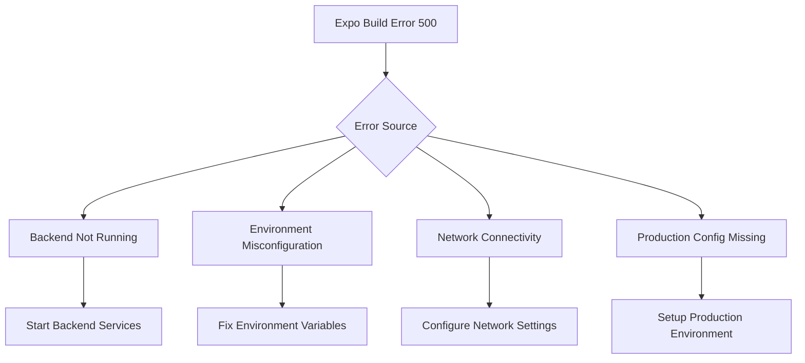
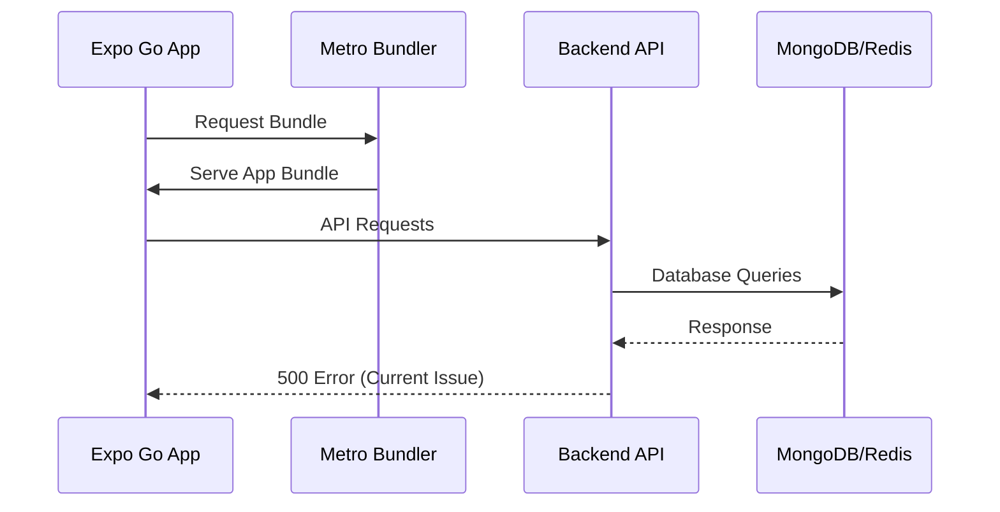

# Expo Build Error Fix - 500 Server Response

## Overview

This document provides a comprehensive solution for resolving Expo Go build errors that result in 500 server responses during development and build processes. The error typically occurs due to misaligned environment configurations, backend connectivity issues, or missing production environment setup.

## Problem Analysis

### Error Context
- **Platform**: Expo Go mobile development
- **Error Type**: 500 Internal Server Error during build/runtime
- **Impact**: Prevents successful mobile app builds and testing

### Root Cause Analysis



## Architecture

### Current Build Flow


### Target Build Flow


## Configuration Issues & Solutions

### Environment Configuration Matrix

| Environment | Frontend Config | Backend Config | Status |
|-------------|----------------|----------------|--------|
| Development | `.env` with local IP | ALLOWED_ORIGINS with mobile IPs | ✅ Configured |
| Production | `.env.production` missing URL | CORS not configured for production | ❌ Needs Fix |
| Testing | Uses development config | Uses development config | ⚠️ Partial |

### Backend Environment Analysis

#### Current CORS Configuration
```typescript
app.use(cors({
  origin: process.env.ALLOWED_ORIGINS?.split(',') || ['http://localhost:3000'],
  credentials: true,
}));
```

#### Current Allowed Origins
```
ALLOWED_ORIGINS=http://localhost:3000,http://localhost:19006,http://192.168.50.214:8081,exp://192.168.50.214:8081
```

### Frontend Environment Analysis

#### Development Configuration
```
EXPO_PUBLIC_API_URL=http://192.168.50.214:3001/api
```

#### Production Configuration (Problematic)
```
EXPO_PUBLIC_API_URL=https://your-backend-domain.com/api
```

## Resolution Strategy

### Immediate Fixes

#### 1. Backend Service Verification
Ensure backend is running and accessible:

```bash
# Check backend health
curl http://192.168.50.214:3001/health

# Expected response:
{
  "status": "OK",
  "timestamp": "2024-01-01T00:00:00.000Z",
  "uptime": 123.456,
  "environment": "development"
}
```

#### 2. Network Connectivity Fix
Update backend CORS to include missing origins:

```typescript
// Add to backend .env
ALLOWED_ORIGINS=http://localhost:3000,http://localhost:19006,http://192.168.50.214:8081,exp://192.168.50.214:8081,exp://192.168.50.214:19000,http://192.168.50.214:19000
```

#### 3. Database Connection Verification
```bash
# Check MongoDB
curl http://192.168.50.214:3001/api/auth/status

# Check Redis connectivity
redis-cli ping
```

### Production Environment Setup

#### Production Backend Configuration
For production builds, configure a publicly accessible backend:

```bash
# Option 1: Use ngrok for testing
ngrok http 3001

# Update .env.production with ngrok URL
EXPO_PUBLIC_API_URL=https://abcd1234.ngrok.io/api
```

#### Production CORS Configuration
```typescript
// Backend production CORS
ALLOWED_ORIGINS=https://your-production-domain.com,https://abcd1234.ngrok.io
```

### Build Process Enhancement

#### EAS Build Configuration Validation

```json
{
  "build": {
    "development": {
      "distribution": "internal",
      "env": {
        "NODE_ENV": "development"
      }
    },
    "production": {
      "env": {
        "NODE_ENV": "production"
      }
    }
  }
}
```

## Implementation Steps

### Phase 1: Environment Validation
1. Verify backend service is running on port 3001
2. Test health endpoint accessibility
3. Validate database connections (MongoDB, Redis)
4. Check network connectivity from mobile device

### Phase 2: Configuration Updates
1. Update backend CORS origins
2. Create proper production environment configuration
3. Validate environment variable loading
4. Test API endpoints with curl

### Phase 3: Build Testing
1. Test development build with Expo Go
2. Validate API connectivity from mobile app
3. Test production build configuration
4. Verify end-to-end functionality

### Phase 4: Monitoring & Validation
1. Implement error logging for build failures
2. Add health checks for critical services
3. Create automated validation scripts
4. Document troubleshooting procedures

## Troubleshooting Workflow

### Diagnostic Commands

```bash
# 1. Check backend status
curl -v http://192.168.50.214:3001/health

# 2. Verify port availability
netstat -an | grep 3001

# 3. Test database connectivity
mongo --host localhost:27017 --eval "db.adminCommand('ping')"

# 4. Check Redis connection
redis-cli -h localhost -p 6379 ping

# 5. Verify Expo metro bundler
npx expo start --clear
```

### Error Resolution Matrix

| Error Pattern | Cause | Solution |
|---------------|-------|----------|
| CORS Error | Missing mobile origins | Add Expo URLs to ALLOWED_ORIGINS |
| Network Timeout | Backend not accessible | Use correct IP address, check firewall |
| 500 Internal Server Error | Database connection failure | Start MongoDB/Redis services |
| Bundle Load Error | Metro bundler issues | Clear cache and restart |
| Environment Variable Error | Missing .env files | Create/update environment files |

## Security Considerations

### Development Security
- Use local IP addresses for development
- Restrict CORS origins to known development URLs
- Enable request rate limiting

### Production Security
- Use HTTPS endpoints only
- Implement proper authentication headers
- Configure production-grade CORS policies
- Enable comprehensive logging

## Testing Strategy

### Unit Testing
- Validate environment variable loading
- Test CORS configuration logic
- Verify API endpoint responses

### Integration Testing
- Test mobile app to backend connectivity
- Validate database operations
- Test build process end-to-end

### Manual Testing
- Test on physical device with Expo Go
- Verify production build functionality
- Test network connectivity scenarios