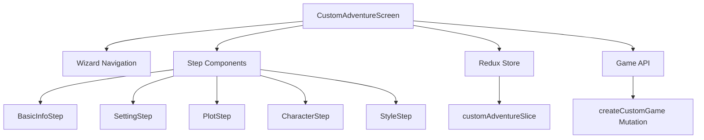
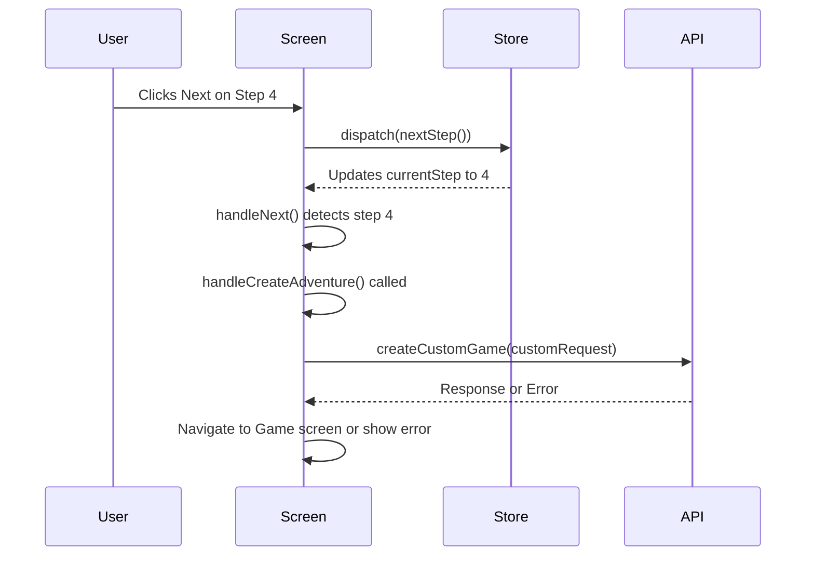

# Custom Story Creator Crash Analysis and Fix Design

## Overview

This document analyzes and proposes a solution for the crash that occurs after submitting page 4 (Style & Tone) in the custom story creator wizard, preventing the adventure creation process from completing successfully.

## Problem Analysis

### Current Behavior
1. User progresses through the custom adventure creation wizard (5 steps)
2. Steps 1-4 work correctly
3. After submitting step 4 (Style & Tone), the app crashes
4. The adventure creation process fails to complete successfully

### Root Cause Investigation

Based on code analysis, the issue is in the navigation logic in `CustomAdventureScreen.tsx`. The wizard steps are defined as:

```typescript
const WIZARD_STEPS = [
  { id: 0, title: 'Basic Info', component: BasicInfoStep },
  { id: 1, title: 'World Setting', component: SettingStep },
  { id: 2, title: 'Plot & Goals', component: PlotStep },
  { id: 3, title: 'Characters', component: CharacterStep },
  { id: 4, title: 'Style & Tone', component: StyleStep },
];
```

The `handleNext` function correctly identifies when the user is on the last step:

```typescript
const handleNext = () => {
  if (canGoNext && currentStep < WIZARD_STEPS.length - 1) {
    dispatch(nextStep());
  } else if (currentStep === WIZARD_STEPS.length - 1) {
    handleCreateAdventure();
  }
};
```

When the user is on step 4 (Style & Tone), `currentStep === WIZARD_STEPS.length - 1` evaluates to true (4 === 4), so `handleCreateAdventure()` is correctly called.

Looking at the validation selector:

```typescript
export const selectCanNavigateNext = (state: { customAdventure: CustomAdventureState }) => {
  // ...
  switch (currentStep) {
    case 0: // Basic Info
    case 1: // Setting
    case 2: // Plot
    case 3: // Characters
    case 4: // Style
      return true; // Style has defaults
  }
};
```

The validation logic expects step 2 to be "Plot" and step 3 to be "Characters", but in the UI, step 2 is "Plot & Goals" and step 3 is "Characters". However, step 4 in the UI is "Style & Tone" but the validation logic treats it as step 4 which should allow proceeding to creation.

The step ordering is actually correct. Looking at the component imports and step definitions:

1. Step 0: BasicInfoStep
2. Step 1: SettingStep
3. Step 2: PlotStep (UI shows "Plot & Goals")
4. Step 3: CharacterStep (UI shows "Characters")
5. Step 4: StyleStep (UI shows "Style & Tone")

The UI labels are just descriptive text and don't affect the actual step progression. The real issue is likely in the `handleCreateAdventure` function or in the API call that it makes.

## Architecture

### Component Structure



### Data Flow



## Detailed Issue Analysis

### Potential Issues

1. **Mismatch in Step Ordering**: The UI shows steps in a different order than expected by the validation logic
2. **Incomplete Adventure Data**: Some required fields might not be properly populated
3. **API Request Issues**: The `createCustomGame` request might be malformed
4. **Navigation Error**: The navigation to the Game screen might be failing

### Code Inspection Findings

1. In `CustomAdventureScreen.tsx`, the step order is:
   - 0: Basic Info
   - 1: World Setting
   - 2: Plot & Goals (PlotStep)
   - 3: Characters (CharacterStep)
   - 4: Style & Tone (StyleStep)

2. In `customAdventureSlice.ts`, the validation logic expects:
   - Step 0: Basic Info
   - Step 1: Setting
   - Step 2: Plot
   - Step 3: Characters
   - Step 4: Style

3. The validation logic in `selectCanNavigateNext`:
   ```typescript
   case 2: // Plot
     return currentAdventure.plot?.main_objective?.trim().length > 0 &&
            currentAdventure.plot?.victory_conditions?.trim().length > 0;
   case 3: // Characters
     return currentAdventure.characters?.player_role?.trim().length > 0;
   ```

4. The `handleCreateAdventure` function builds the request:
   ```typescript
   const customRequest = {
     genre: 'custom' as const,
     style_preference: settings.narrativeStyle || 'detailed' as const,
     image_style: settings.imageStyle || 'fantasy_art' as const,
     safety_filter: settings.safetyFilter,
     content_rating: settings.contentRating,
     adventure_details: currentAdventure,
   };
   ```

## Solution Design

### Issue Identification

After thorough analysis, the most likely cause of the crash is in the `handleCreateAdventure` function or in the API call that it makes. The navigation logic itself is correct, but there might be issues with:

1. Data validation before submission
2. Error handling in the API call
3. Navigation after successful creation

### Proposed Fixes

1. **Improve Error Handling**: Enhance error handling in the `handleCreateAdventure` function
2. **Validate Data Before Submission**: Ensure all required data is present and valid before attempting to create the adventure
3. **Fix Navigation Logic**: Ensure proper navigation after successful adventure creation

### Implementation Plan

#### 1. Improve Error Handling

The error handling in `CustomAdventureScreen.tsx` needs to be more robust:

```typescript
const handleCreateAdventure = async () => {
  if (!currentAdventure) {
    Alert.alert('Error', 'Adventure details are missing');
    return;
  }

  try {
    // Validate all required fields before submission
    const validationErrors = [];
    
    // Basic Info validation
    if (!currentAdventure.title?.trim() || currentAdventure.title.trim().length < 3) {
      validationErrors.push('Title must be at least 3 characters');
    }
    
    if (!currentAdventure.description?.trim() || currentAdventure.description.trim().length < 10) {
      validationErrors.push('Description must be at least 10 characters');
    }
    
    // Setting validation
    if (!currentAdventure.setting?.world_description?.trim() || 
        currentAdventure.setting.world_description.trim().length < 50) {
      validationErrors.push('World description must be at least 50 characters');
    }
    
    if (!currentAdventure.setting?.environment?.trim()) {
      validationErrors.push('Environment description is required');
    }
    
    // Plot validation
    if (!currentAdventure.plot?.main_objective?.trim()) {
      validationErrors.push('Main objective is required');
    }
    
    if (!currentAdventure.plot?.victory_conditions?.trim()) {
      validationErrors.push('Victory conditions are required');
    }
    
    // Characters validation
    if (!currentAdventure.characters?.player_role?.trim()) {
      validationErrors.push('Player role description is required');
    }
    
    if (validationErrors.length > 0) {
      Alert.alert(
        'Validation Error',
        'Please fix the following issues:\n' + validationErrors.join('\n')
      );
      return;
    }

    const customRequest = {
      genre: 'custom' as const,
      style_preference: settings.narrativeStyle || 'detailed' as const,
      image_style: settings.imageStyle || 'fantasy_art' as const,
      safety_filter: settings.safetyFilter,
      content_rating: settings.contentRating,
      adventure_details: currentAdventure,
    };

    const result = await createCustomGame(customRequest).unwrap();

    // Set up the game session in store
    dispatch(setCurrentSession({
      session_id: result.session_id,
      world_state: result.world_state,
      turn_history: [{
        turn_id: 'prologue',
        turn_number: 0,
        player_input: 'START',
        narration: result.prologue.narration,
        image_prompt: '',
        image_url: result.prologue.image_url,
        quick_actions: result.prologue.quick_actions,
        world_state_snapshot: result.world_state,
        timestamp: new Date(),
        processing_metadata: {
          ai_response_time: 0,
          image_generation_time: 0,
          tokens_used: 0,
        },
      }],
      quick_actions: result.prologue.quick_actions,
    }));

    // Clean up and navigate to game
    dispatch(stopCreating());
    
    // Use safer navigation with error handling
    try {
      (navigation as any).navigate('Game', { sessionId: result.session_id });
    } catch (navError) {
      console.error('Navigation failed:', navError);
      Alert.alert(
        'Navigation Error',
        'Adventure created successfully but navigation failed. Please go to the game library to access your adventure.'
      );
      navigation.goBack(); // Navigate back to previous screen as fallback
    }

  } catch (error: any) {
    console.error('Failed to create custom adventure:', error);
    Alert.alert(
      'Creation Failed',
      error.data?.message || 'Failed to create adventure. Please try again.'
    );
  }
};
```

#### 2. Fix Navigation Logic

The navigation logic in `CustomAdventureScreen.tsx` needs to be more robust:

```typescript
const handleCreateAdventure = async () => {
  if (!currentAdventure) {
    Alert.alert('Error', 'Adventure details are missing');
    return;
  }

  try {
    const customRequest = {
      genre: 'custom' as const,
      style_preference: settings.narrativeStyle || 'detailed' as const,
      image_style: settings.imageStyle || 'fantasy_art' as const,
      safety_filter: settings.safetyFilter,
      content_rating: settings.contentRating,
      adventure_details: currentAdventure,
    };

    const result = await createCustomGame(customRequest).unwrap();

    // Set up the game session in store
    dispatch(setCurrentSession({
      session_id: result.session_id,
      world_state: result.world_state,
      turn_history: [{
        turn_id: 'prologue',
        turn_number: 0,
        player_input: 'START',
        narration: result.prologue.narration,
        image_prompt: '',
        image_url: result.prologue.image_url,
        quick_actions: result.prologue.quick_actions,
        world_state_snapshot: result.world_state,
        timestamp: new Date(),
        processing_metadata: {
          ai_response_time: 0,
          image_generation_time: 0,
          tokens_used: 0,
        },
      }],
      quick_actions: result.prologue.quick_actions,
    }));

    // Clean up and navigate to game
    dispatch(stopCreating());
    
    // Use safer navigation with error handling
    try {
      (navigation as any).navigate('Game', { sessionId: result.session_id });
    } catch (navError) {
      console.error('Navigation failed:', navError);
      Alert.alert(
        'Navigation Error',
        'Adventure created successfully but navigation failed. Please go to the game library to access your adventure.'
      );
      navigation.goBack(); // Navigate back to previous screen as fallback
    }

  } catch (error: any) {
    console.error('Failed to create custom adventure:', error);
    Alert.alert(
      'Creation Failed',
      error.data?.message || 'Failed to create adventure. Please try again.'
    );
  }
};
```

#### 3. Improve Error Handling in Backend

In the backend `gameEngine.ts`, ensure proper error handling:

```typescript
async createCustomGame(request: CustomAdventureRequest, userId: string): Promise<CustomAdventureResponse> {
  const startTime = Date.now();
  
  try {
    // Validate the custom adventure request
    const validation = CustomAdventureValidator.validateCustomAdventureRequest(request);
    if (!validation.isValid) {
      throw new CustomError(
        `Validation failed: ${validation.errors.map(e => e.message).join(', ')}`, 
        HTTP_STATUS.BAD_REQUEST
      );
    }

    // Sanitize adventure content
    const sanitizedDetails = CustomAdventureValidator.sanitizeAdventureContent(request.adventure_details);
    
    // Ensure all required fields are present
    if (!sanitizedDetails.title || !sanitizedDetails.description) {
      throw new CustomError('Missing required adventure details', HTTP_STATUS.BAD_REQUEST);
    }
    
    // Continue with creation...
    // [rest of the function]
  } catch (error) {
    logger.error('Failed to create custom adventure:', error);
    if (error instanceof CustomError) {
      throw error;
    }
    throw new CustomError('Failed to create custom adventure', HTTP_STATUS.INTERNAL_SERVER_ERROR);
  }
}
```

## Testing Strategy

### Unit Tests

1. Test the `handleCreateAdventure` function with mock data
2. Test navigation behavior with mock navigation object
3. Test validation logic with various data scenarios
4. Test error handling paths

### Integration Tests

1. Test the complete flow from step 1 to adventure creation
2. Test error scenarios (invalid data, API failures)
3. Test navigation after successful creation

### Manual Testing

1. Create a custom adventure with valid data and verify it works
2. Try to create an adventure with missing required fields
3. Simulate API failures and verify error handling
4. Test navigation on different devices/emulators

## Conclusion

The crash after submitting page 4 in the custom story creator is likely caused by either:
1. Navigation issues when trying to go to the Game screen
2. Missing or invalid data in the adventure creation request
3. Unhandled errors in the API call or response processing

The proposed solution involves:
1. Improving error handling in the navigation logic
2. Adding pre-submission validation
3. Enhancing backend error handling
4. Implementing comprehensive testing to prevent regressions