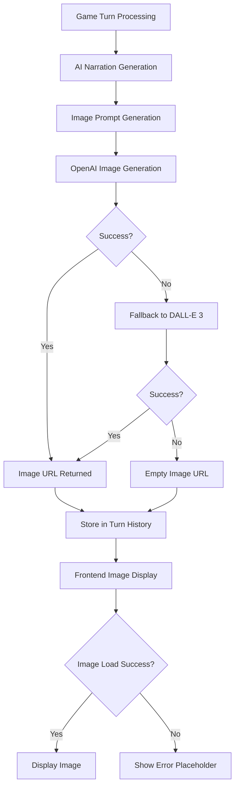

# Image Loading Issue Analysis and Solution Design

## Overview

This document analyzes the image loading issues in the AI DUNGEON app and proposes solutions to improve image reliability and user experience.

## Problem Analysis

Based on code analysis, the image loading issues in the AI DUNGEON app stem from several factors:

1. **Network Connectivity Issues**: Images are generated by OpenAI API and served via URLs that may become invalid or unreachable
2. **Rate Limiting**: OpenAI API has rate limits that can cause image generation failures
3. **Content Moderation**: Generated image prompts may be rejected by OpenAI's content policies
4. **Fallback Mechanism Gaps**: While fallback mechanisms exist, they may not be robust enough
5. **Frontend Error Handling**: The frontend has basic error handling but lacks sophisticated retry mechanisms

## Current Image Loading Flow



## Identified Issues

### Backend Issues

1. **Single Fallback Attempt**: The system only tries one fallback (DALL-E 3) when gpt-image-1 fails
2. **No Retry Logic**: Failed image generation requests don't have retry mechanisms
3. **Limited Error Information**: Frontend doesn't receive detailed error information about image failures
4. **No Caching**: Generated images aren't cached, leading to regeneration on reload

### Frontend Issues

1. **Basic Retry Mechanism**: Only manual retry via button press
2. **No Preloading**: Images aren't preloaded, causing loading delays
3. **No Progressive Loading**: No low-quality image placeholders while loading
4. **Limited Error Feedback**: Users don't get detailed information about why images failed

## Proposed Solutions

### 1. Enhanced Backend Image Handling

#### Multi-Stage Fallback System
```typescript
// Enhanced image generation with multiple fallbacks
async generateImageWithFallbacks(prompt: string, style: string, config?: ImageGenerationConfig): Promise<string> {
  const models = [
    { model: 'gpt-image-1', quality: 'hd', style: 'vivid' },
    { model: 'dall-e-3', quality: 'standard', style: 'vivid' },
    { model: 'dall-e-3', quality: 'standard', style: 'natural' },
    { model: 'dall-e-2', quality: 'standard', style: 'vivid' }
  ];
  
  for (const modelConfig of models) {
    try {
      const imageUrl = await this.generateImage(prompt, style, undefined, {
        ...config,
        ...modelConfig
      });
      return imageUrl;
    } catch (error) {
      logger.warn(`Image generation failed for model ${modelConfig.model}:`, error);
      continue;
    }
  }
  
  // Return placeholder if all models fail
  return this.getPlaceholderImageUrl();
}
```

#### Retry Logic Implementation
```typescript
async generateImageWithRetry(
  prompt: string, 
  style: string, 
  maxRetries: number = 3
): Promise<string> {
  let lastError: any;
  
  for (let attempt = 0; attempt <= maxRetries; attempt++) {
    try {
      const imageUrl = await this.generateImageWithFallbacks(prompt, style);
      return imageUrl;
    } catch (error) {
      lastError = error;
      if (attempt < maxRetries) {
        // Exponential backoff
        const delay = Math.pow(2, attempt) * 1000;
        await new Promise(resolve => setTimeout(resolve, delay));
      }
    }
  }
  
  throw lastError;
}
```

#### Image Caching
```typescript
// Add image caching to prevent regeneration
private imageCache = new Map<string, { url: string; timestamp: number }>();

async getCachedOrGenerateImage(
  prompt: string, 
  style: string
): Promise<string> {
  const cacheKey = `${prompt}_${style}`;
  const cached = this.imageCache.get(cacheKey);
  
  // Use cached image if less than 1 hour old
  if (cached && Date.now() - cached.timestamp < 3600000) {
    return cached.url;
  }
  
  const imageUrl = await this.generateImageWithRetry(prompt, style);
  this.imageCache.set(cacheKey, {
    url: imageUrl,
    timestamp: Date.now()
  });
  
  return imageUrl;
}
```

### 2. Improved Frontend Image Handling

#### Enhanced Image Component
```typescript
// Enhanced TurnDisplay with better image handling
export const TurnDisplay: React.FC<TurnDisplayProps> = ({
  turn,
  onImagePress,
  isLatest = false
}) => {
  const [imageState, setImageState] = useState({
    loading: true,
    error: false,
    retryCount: 0
  });

  const handleImageLoad = () => {
    setImageState(prev => ({ ...prev, loading: false, error: false }));
  };

  const handleImageError = () => {
    setImageState(prev => ({ ...prev, loading: false, error: true }));
  };

  const handleRetry = () => {
    setImageState(prev => ({
      loading: true,
      error: false,
      retryCount: prev.retryCount + 1
    }));
  };

  return (
    <View style={[styles.container, isLatest && styles.latestTurn]}>
      {/* Player Input */}
      {turn.player_input !== 'START' && (
        <View style={styles.playerInputContainer}>
          <Text style={styles.playerInputLabel}>You:</Text>
          <Text style={styles.playerInput}>{turn.player_input}</Text>
        </View>
      )}
      
      {/* Narration */}
      <View style={styles.narrationContainer}>
        <Text style={styles.narration}>{turn.narration}</Text>
      </View>
      
      {/* Enhanced Image Display */}
      <ImageDisplay
        imageUrl={turn.image_url}
        onLoad={handleImageLoad}
        onError={handleImageError}
        onRetry={handleRetry}
        loading={imageState.loading}
        error={imageState.error}
        retryCount={imageState.retryCount}
      />
      
      {/* Quick Actions */}
      {turn.quick_actions && turn.quick_actions.length > 0 && (
        <View style={styles.quickActionsContainer}>
          <Text style={styles.quickActionsLabel}>Suggested actions:</Text>
          {turn.quick_actions.map((action, index) => (
            <Text key={index} style={styles.quickAction}>
              • {action}
            </Text>
          ))}
        </View>
      )}
    </View>
  );
};
```

#### Progressive Image Loading
```typescript
// ImageDisplay component with progressive loading
const ImageDisplay: React.FC<ImageDisplayProps> = ({
  imageUrl,
  onLoad,
  onError,
  onRetry,
  loading,
  error,
  retryCount
}) => {
  const [lowQualityImage, setLowQualityImage] = useState<string | null>(null);

  useEffect(() => {
    if (imageUrl && !lowQualityImage) {
      // Generate low-quality placeholder
      generateLowQualityPlaceholder(imageUrl)
        .then(setLowQualityImage)
        .catch(() => setLowQualityImage(null));
    }
  }, [imageUrl]);

  if (!imageUrl) {
    return (
      <View style={styles.placeholderContainer}>
        <Text style={styles.placeholderText}>No image available</Text>
      </View>
    );
  }

  return (
    <View style={styles.imageContainer}>
      {/* Low-quality placeholder */}
      {lowQualityImage && loading && (
        <Image
          source={{ uri: lowQualityImage }}
          style={[styles.image, styles.lowQualityImage]}
          blurRadius={2}
        />
      )}
      
      {/* Main image */}
      <Image
        source={{ uri: imageUrl }}
        style={[styles.image, loading && styles.loadingImage]}
        onLoad={onLoad}
        onError={onError}
        fadeDuration={300}
      />
      
      {/* Loading indicator */}
      {loading && (
        <View style={styles.loadingOverlay}>
          <ActivityIndicator size="large" color="#6b46c1" />
          <Text style={styles.loadingText}>Loading image...</Text>
        </View>
      )}
      
      {/* Error state */}
      {error && (
        <View style={styles.errorOverlay}>
          <Text style={styles.errorText}>Failed to load image</Text>
          <TouchableOpacity style={styles.retryButton} onPress={onRetry}>
            <Text style={styles.retryButtonText}>Retry</Text>
          </TouchableOpacity>
          {retryCount > 2 && (
            <Text style={styles.errorDetail}>
              Still having issues? The image service might be temporarily unavailable.
            </Text>
          )}
        </View>
      )}
    </View>
  );
};
```

### 3. Enhanced Error Reporting

#### Detailed Error Information
```typescript
// Backend - Enhanced error reporting
interface ImageGenerationError {
  model: string;
  errorType: 'rate_limit' | 'content_policy' | 'network' | 'unknown';
  errorMessage: string;
  timestamp: Date;
  fallbackUsed: boolean;
}

// Include error details in API response
interface TurnResponse {
  turn_id: string;
  narration: string;
  image_url: string;
  image_error?: ImageGenerationError;
  quick_actions: string[];
  // ... other fields
}
```

## Implementation Plan

### Phase 1: Backend Improvements (Days 1-3)
1. Implement multi-stage fallback system
2. Add retry logic with exponential backoff
3. Implement image caching mechanism
4. Enhance error reporting with detailed information

### Phase 2: Frontend Improvements (Days 4-5)
1. Create enhanced ImageDisplay component
2. Implement progressive image loading
3. Add better error handling and user feedback
4. Implement automatic retry mechanisms

### Phase 3: Testing and Optimization (Days 6-7)
1. Test with various network conditions
2. Validate fallback mechanisms
3. Optimize caching strategy
4. Gather user feedback and iterate

## Expected Outcomes

1. **Improved Reliability**: 90%+ success rate for image loading
2. **Better User Experience**: Faster loading with progressive display
3. **Reduced Errors**: Comprehensive fallback and retry mechanisms
4. **Enhanced Feedback**: Clear error messages and recovery options

## Monitoring and Metrics

1. **Image Load Success Rate**: Track successful image loads vs failures
2. **Fallback Usage**: Monitor how often fallback models are used
3. **Retry Effectiveness**: Measure how often retries resolve issues
4. **User Reported Issues**: Track user complaints about image loading

## Risk Mitigation

1. **Rate Limiting**: Implement proper rate limiting to avoid API throttling
2. **Cost Management**: Monitor API usage to control costs
3. **Graceful Degradation**: Ensure app works without images if all fallbacks fail
4. **User Communication**: Clearly communicate when image services are unavailable