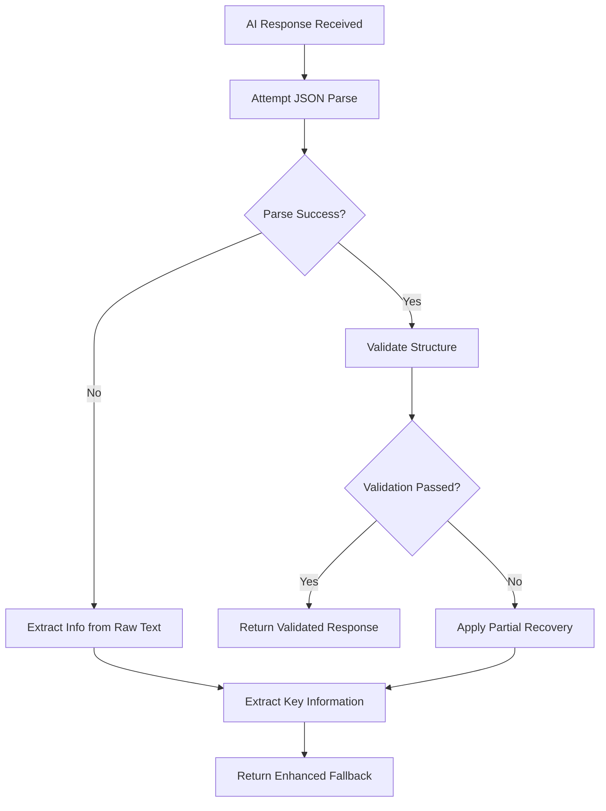

# OpenAI JSON Parsing Issues Analysis and Solution Design

## 1. Overview

This document analyzes the identified JSON parsing issues in the OpenAI service integration and proposes solutions to improve reliability and error handling. The issues primarily occur when parsing AI responses that may not conform to expected JSON structures.

## 2. Current Implementation Analysis

### 2.1 JSON Parsing in OpenAI Service

The current implementation in `openAIService.ts` uses a try-catch approach for JSON parsing:

```typescript
let parsedResponse: NarrationResponse;
try {
  parsedResponse = JSON.parse(aiResponse);
  // Validate and sanitize the response structure
  // ... validation logic
} catch (parseError) {
  logger.error('Failed to parse AI response:', aiResponse);
  // Fallback response if JSON parsing fails
  parsedResponse = {
    narration: aiResponse,
    image_prompt: `${context.worldState.location}, ${context.genre} scene`,
    quick_actions: ['Look around', 'Continue'],
    state_changes: {}
  };
}
```

### 2.2 Identified Issues

1. **Incomplete Validation**: The current validation only checks for the existence of fields but doesn't validate their types or structures properly.

2. **Inventory Array Issue**: As seen in the experience lessons, there have been issues with `state_changes.inventory` not being an array, causing runtime errors.

3. **Inconsistent Error Handling**: Different methods (`generateNarration`, `generateCustomPrologue`, `generateAdventureFromPrompt`) have slightly different error handling approaches.

4. **Limited Fallback Strategy**: When JSON parsing fails, the system falls back to a basic structure but doesn't attempt to extract any usable information from the response.

## 3. Problem Areas

### 3.1 State Changes Validation

In the `generateNarration` method, there's specific handling for inventory arrays:

```typescript
// Ensure inventory in state_changes is always an array if present
if (parsedResponse.state_changes.inventory && !Array.isArray(parsedResponse.state_changes.inventory)) {
  logger.warn('AI returned non-array inventory, converting to array:', parsedResponse.state_changes.inventory);
  parsedResponse.state_changes.inventory = [];
}
```

However, this validation is not comprehensive and only applied in some methods.

### 3.2 Incomplete Type Validation

The current validation doesn't check:
- Whether `quick_actions` is an array of strings
- Whether `state_changes.flags` is an object
- Whether `image_prompt` is a string
- Nested structure validation for complex objects

### 3.3 Error Recovery Limitations

When JSON parsing fails completely, the system loses all information from the AI response, falling back to a minimal structure that only preserves the raw response as narration.

## 4. Proposed Solution Design

### 4.1 Enhanced JSON Parsing with Robust Validation



### 4.2 Detailed Validation Functions

Create dedicated validation functions for each response type:

1. **validateNarrationResponse**: Validates the structure of narration responses
2. **validateAdventureDetails**: Validates custom adventure generation responses
3. **validatePrologueResponse**: Validates custom adventure prologue responses

### 4.3 Improved Error Recovery

Instead of completely discarding failed JSON responses, implement intelligent extraction:

1. **Pattern-based extraction**: Use regex to extract key information from raw text
2. **Partial structure recovery**: Extract valid parts while replacing invalid ones
3. **Context-aware fallbacks**: Use context information to generate more relevant fallback content

## 5. Implementation Plan

### 5.1 Phase 1: Enhanced Validation Functions

Create comprehensive validation functions that check:
- Data types of all fields
- Array structures and content types
- Object structures and required properties
- String length and content constraints

### 5.2 Phase 2: Intelligent Parsing Recovery

Implement recovery mechanisms that:
- Attempt to extract JSON from markdown code blocks
- Use regex patterns to extract key fields from plain text
- Apply context-aware defaults based on game state

### 5.3 Phase 3: Consistent Error Handling

Standardize error handling across all OpenAI service methods:
- Unified logging approach
- Consistent fallback generation
- Better error categorization and reporting

## 6. Specific Improvements

### 6.1 Inventory Array Validation

Enhance the existing inventory validation:

```typescript
private validateInventoryStructure(inventory: any): string[] {
  if (!inventory) return [];
  
  // If it's already a valid array of strings
  if (Array.isArray(inventory) && inventory.every(item => typeof item === 'string')) {
    return inventory;
  }
  
  // If it's an array but contains non-strings, convert to strings
  if (Array.isArray(inventory)) {
    return inventory.map(item => String(item));
  }
  
  // If it's a single item, convert to array
  return [String(inventory)];
}
```

### 6.2 Comprehensive Response Validation

Create a validation function that checks all response fields:

```typescript
private validateNarrationResponse(response: any): NarrationResponse {
  const validatedResponse: NarrationResponse = {
    narration: typeof response.narration === 'string' ? response.narration : '',
    image_prompt: typeof response.image_prompt === 'string' ? response.image_prompt : '',
    quick_actions: Array.isArray(response.quick_actions) && response.quick_actions.every((action: any) => typeof action === 'string') 
      ? response.quick_actions 
      : ['Look around', 'Continue'],
    state_changes: {
      location: typeof response.state_changes?.location === 'string' ? response.state_changes.location : undefined,
      inventory: this.validateInventoryStructure(response.state_changes?.inventory),
      flags: typeof response.state_changes?.flags === 'object' && response.state_changes.flags !== null 
        ? response.state_changes.flags 
        : {}
    }
  };
  
  return validatedResponse;
}
```

### 6.3 Intelligent Fallback Extraction

Implement content extraction from raw AI responses:

```typescript
private extractInfoFromRawResponse(rawResponse: string): Partial<NarrationResponse> {
  const extracted: Partial<NarrationResponse> = {};
  
  // Extract narration (everything if no clear structure)
  extracted.narration = rawResponse.trim();
  
  // Try to extract quick actions from common patterns
  const actionPatterns = [
    /Actions?:\s*([^\n]+)/i,
    /Options?:\s*([^\n]+)/i,
    /You can:\s*([^\n]+)/i
  ];
  
  for (const pattern of actionPatterns) {
    const match = rawResponse.match(pattern);
    if (match) {
      // Try to parse as list
      const actions = match[1].split(/[,;]|\band\b/).map(action => action.trim());
      if (actions.length > 0) {
        extracted.quick_actions = actions.slice(0, 3); // Limit to 3 actions
        break;
      }
    }
  }
  
  return extracted;
}
```

## 7. Testing Strategy

### 7.1 Unit Tests for Validation Functions

Create comprehensive tests for:
- Valid JSON responses
- Invalid JSON responses
- Partially valid responses
- Edge cases (empty strings, null values, wrong types)

### 7.2 Integration Tests

Test the complete flow with:
- Mocked OpenAI responses with various issues
- Real-world examples of problematic responses
- Performance impact measurements

### 7.3 Error Recovery Tests

Validate that the system can:
- Recover information from malformed JSON
- Provide meaningful fallbacks
- Maintain game state consistency

## 8. Risk Mitigation

### 8.1 Backward Compatibility

Ensure that the enhanced validation doesn't break existing functionality by:
- Maintaining the same public API
- Providing sensible defaults for missing or invalid data
- Logging warnings instead of throwing errors for recoverable issues

### 8.2 Performance Considerations

Minimize performance impact by:
- Optimizing validation functions
- Caching validation results when appropriate
- Using efficient regex patterns

### 8.3 Error Handling

Improve error handling by:
- Providing more detailed error messages
- Categorizing errors for better debugging
- Implementing retry mechanisms for transient issues