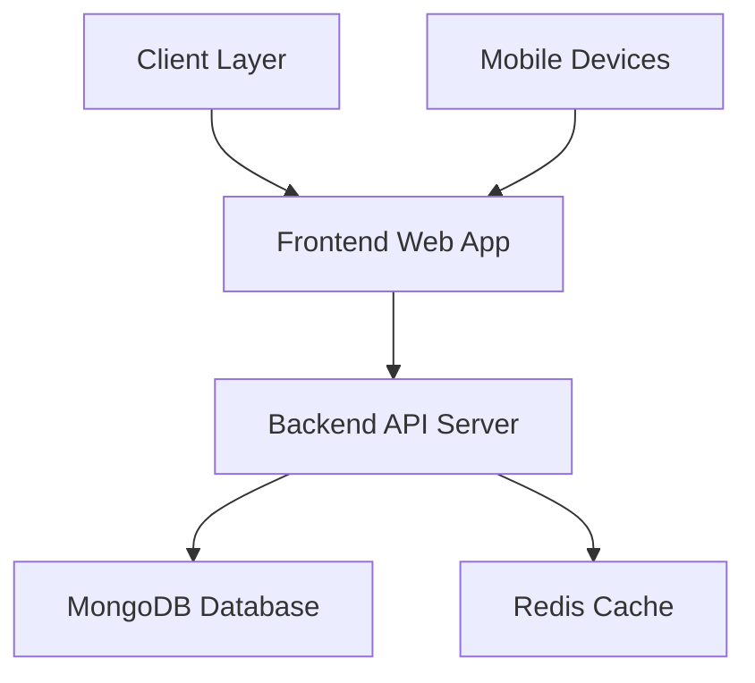
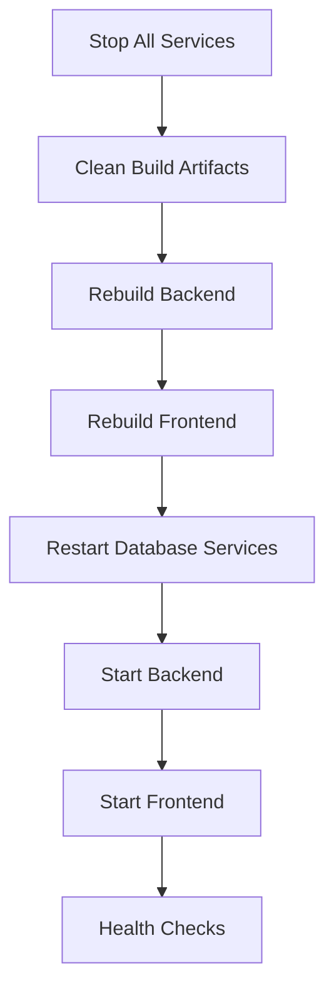
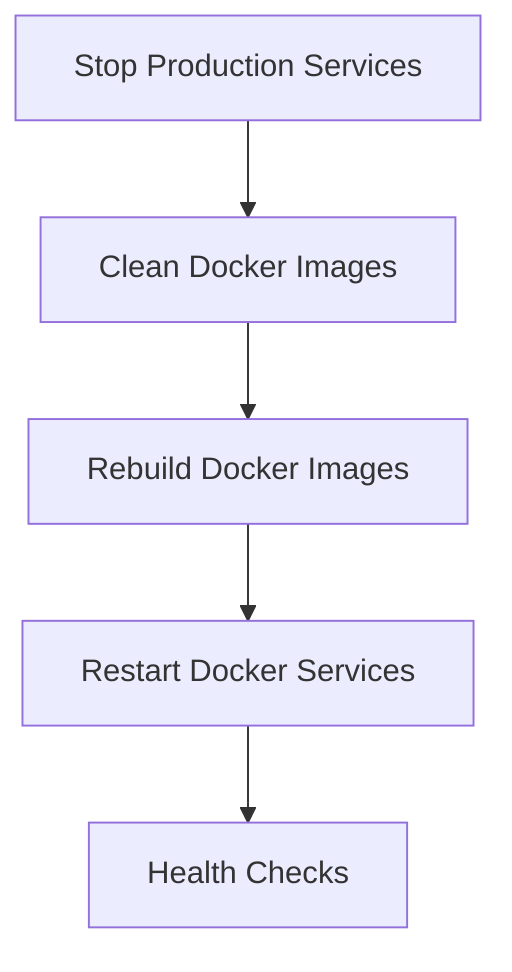

# Rebuild and Restart App Design Document

## 1. Overview

This document outlines the design for implementing a comprehensive rebuild and restart functionality for the AI Dungeon Adventure application. The solution provides mechanisms to rebuild and restart all components including the backend API, frontend web app, and database services in both development and production environments.

## 2. System Architecture

The AI Dungeon Adventure application consists of:



### Component Details:
- **Frontend**: React Native/Expo web application (port 19006/8082 dev, 3000 prod)
- **Backend**: Node.js/Express API server (port 3001)
- **Database**: MongoDB (port 27017)
- **Cache**: Redis (port 6379)
- **Reverse Proxy**: Nginx (port 80/443 prod)

## 3. Rebuild and Restart Strategies

### 3.1 Development Environment

#### 3.1.1 Process Flow



#### 3.1.2 Implementation Steps

1. **Service Termination**:
   - Kill processes on ports 3001 (backend), 19006/8081/8082 (frontend)
   - Stop Docker containers

2. **Clean Build Artifacts**:
   - Remove `node_modules` directories
   - Remove build output directories (`dist`, `web-build`)

3. **Rebuild Components**:
   - Backend: `npm run build` in backend directory
   - Frontend: `npm run build` in frontend directory

4. **Restart Services**:
   - Start MongoDB and Redis via Docker Compose
   - Start backend server
   - Start frontend development server

### 3.2 Production Environment

#### 3.2.1 Process Flow



#### 3.2.2 Implementation Steps

1. **Service Termination**:
   - Stop all Docker containers: `docker-compose down`

2. **Clean Docker Images**:
   - Remove existing images: `docker-compose rm -f`

3. **Rebuild Docker Images**:
   - Build with no cache: `docker-compose build --no-cache`

4. **Restart Services**:
   - Start services: `docker-compose up -d`
   - Wait for services to be healthy

## 4. Automation Scripts

### 4.1 Development Rebuild Script

Create `rebuild-dev.sh` with functionality:

```bash
#!/bin/bash
# Rebuild and restart development environment

# Stop services
echo "🛑 Stopping services..."
pkill -f "node.*server" 2>/dev/null || true
pkill -f "expo start" 2>/dev/null || true

# Clean build artifacts
echo "🧹 Cleaning build artifacts..."
rm -rf backend/node_modules backend/dist
rm -rf frontend/node_modules frontend/web-build

# Reinstall dependencies
echo "📦 Installing dependencies..."
cd backend && npm install && cd ..
cd frontend && npm install && cd ..

# Rebuild
echo "🔨 Rebuilding..."
cd backend && npm run build && cd ..
cd frontend && npm run build && cd ..

# Restart services
echo "🚀 Restarting services..."
./launch-game.sh
```

### 4.2 Production Rebuild Script

Create `rebuild-prod.sh` with functionality:

```bash
#!/bin/bash
# Rebuild and restart production environment

# Stop services
echo "🛑 Stopping production services..."
docker-compose down

# Clean images
echo "🧹 Cleaning Docker images..."
docker-compose rm -f

# Rebuild and restart
echo "🔨 Rebuilding and restarting..."
./deploy.sh
```

## 5. Health Checks

### 5.1 Backend Health Check
- Endpoint: `GET /health`
- Expected: HTTP 200 with JSON response

### 5.2 Frontend Health Check
- Endpoint: Root URL
- Expected: HTTP 200 with HTML response

### 5.3 Database Health Check
- MongoDB: `mongosh --eval "db.adminCommand('ping')"`
- Redis: `redis-cli ping`

## 6. Error Handling

| Scenario | Recovery Action |
|---------|----------------|
| Port conflicts | Kill processes on conflicting ports |
| Missing dependencies | Reinstall node_modules |
| Database connection failures | Restart database containers |
| Build failures | Clean build artifacts and retry |