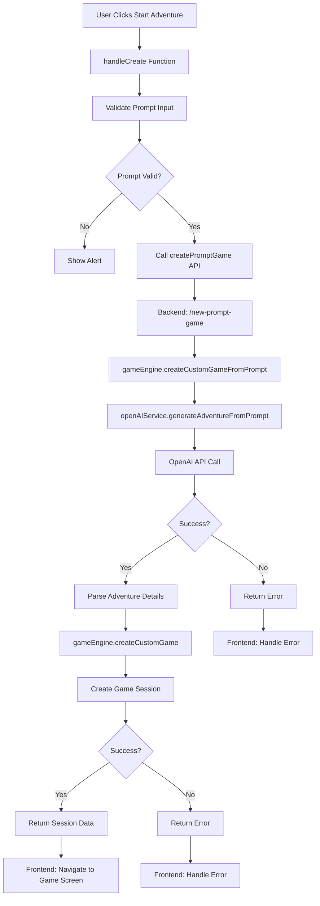

# Start Adventure Button Fix Design Document

## Overview

This document outlines the issue with the "Start Adventure" button not functioning when creating a custom story from a prompt in the AI Dungeon Adventure application. The button appears to be clickable but doesn't trigger any action, preventing users from starting their custom adventures.

## Problem Analysis

### Current Implementation

1. **Frontend ([PromptAdventureScreen.tsx](file:///Users/tiuni/AI%20DUNGEON/frontend/src/screens/PromptAdventureScreen.tsx))**:
   - Uses `useCreatePromptGameMutation` hook from `gameApi` service
   - Has a `handleCreate` function that should trigger when the button is pressed
   - Button is properly wired with `onPress={handleCreate}`

2. **Backend (game.ts routes)**:
   - Has a `/new-prompt-game` endpoint that handles prompt-based adventure creation
   - Calls `gameEngine.createCustomGameFromPrompt` which generates adventure details from the prompt
   - Then calls `gameEngine.createCustomGame` to create the actual game session

3. **Service Layer (openAIService.ts)**:
   - Contains `generateAdventureFromPrompt` method that converts user prompt to structured adventure details
   - Uses OpenAI API to generate the adventure structure

### Potential Issues Identified

1. **Error Handling**: The frontend may not be properly handling errors from the API call, causing the UI to appear unresponsive
2. **API Communication**: There may be issues with the API endpoint or communication between frontend and backend
3. **OpenAI Service**: The OpenAI service might be failing silently without proper error propagation
4. **Validation Issues**: Request validation might be failing without proper error feedback
5. **Loading State**: The loading state might not be properly managed, making it seem like nothing is happening

## Architecture



## Solution Design

### 1. Enhanced Error Handling

The primary fix will focus on improving error handling and user feedback in the frontend:

```typescript
const handleCreate = async () => {
  if (!prompt.trim()) {
    Alert.alert('Prompt Required', 'Please enter a prompt to continue.');
    return;
  }

  try {
    const result = await createPromptGame({
      prompt,
      style_preference: stylePreference,
      image_style: imageStyle,
      safety_filter: settings.safetyFilter,
      content_rating: settings.contentRating,
    }).unwrap();

    dispatch(setCurrentSession({
      session_id: result.session_id,
      world_state: result.world_state,
      turn_history: [{
        turn_id: 'prologue',
        turn_number: 0,
        player_input: 'START',
        narration: result.prologue.narration,
        image_prompt: '',
        image_url: result.prologue.image_url,
        quick_actions: result.prologue.quick_actions,
        world_state_snapshot: result.world_state,
        timestamp: new Date(),
        processing_metadata: {
          ai_response_time: 0,
          image_generation_time: 0,
          tokens_used: 0,
        },
      }],
      quick_actions: result.prologue.quick_actions,
    }));

    (navigation as any).navigate('Game', { sessionId: result.session_id });
  } catch (error: any) {
    console.error('Failed to create prompt adventure:', error);
    // Enhanced error handling
    let errorMessage = 'Failed to create adventure. Please try again.';
    
    if (error.data?.message) {
      errorMessage = error.data.message;
    } else if (error.status === 429) {
      errorMessage = 'Rate limit exceeded. Please wait before trying again.';
    } else if (error.status === 500) {
      errorMessage = 'Server error. Please try again later.';
    } else if (error.status === 400) {
      errorMessage = 'Invalid request. Please check your input.';
    }
    
    Alert.alert('Error', errorMessage);
  }
};
```

### 2. Backend Improvements

Enhance error handling and logging in the backend:

```typescript
// In backend/src/routes/game.ts
router.post('/new-prompt-game', [
  // ... existing validation
], asyncHandler(async (req: AuthRequest, res: Response) => {
  const errors = validationResult(req);
  if (!errors.isEmpty()) {
    return res.status(HTTP_STATUS.BAD_REQUEST).json({
      error: 'Validation failed',
      message: errors.array().map(e => e.msg).join(', '),
      status: HTTP_STATUS.BAD_REQUEST
    });
  }

  if (!req.user) {
    return res.status(HTTP_STATUS.UNAUTHORIZED).json({
      error: ERROR_MESSAGES.UNAUTHORIZED_ACCESS,
      message: ERROR_MESSAGES.UNAUTHORIZED_ACCESS,
      status: HTTP_STATUS.UNAUTHORIZED
    });
  }

  try {
    const promptRequest: PromptAdventureRequest = req.body;
    const result = await gameEngine.createCustomGameFromPrompt(promptRequest, req.user.id);
    res.status(HTTP_STATUS.CREATED).json(result);
  } catch (error: any) {
    logger.error('Failed to create prompt adventure:', error);
    
    // Enhanced error response
    if (error instanceof CustomError) {
      return res.status(error.statusCode).json({
        error: error.message,
        message: error.message,
        status: error.statusCode
      });
    }
    
    return res.status(HTTP_STATUS.INTERNAL_SERVER_ERROR).json({
      error: 'Failed to create adventure',
      message: 'An unexpected error occurred while creating your adventure',
      status: HTTP_STATUS.INTERNAL_SERVER_ERROR
    });
  }
}));
```

### 3. OpenAI Service Improvements

Enhance error handling in the OpenAI service:

```typescript
// In backend/src/services/openAIService.ts
async generateAdventureFromPrompt(prompt: string): Promise<AdventureDetails> {
  if (!this.openai.apiKey) {
    throw new CustomError(ERROR_MESSAGES.AI_SERVICE_ERROR, HTTP_STATUS.INTERNAL_SERVER_ERROR);
  }

  const startTime = Date.now();

  try {
    const systemPrompt = 'You are an AI that creates detailed JSON for text adventures. Return a JSON matching the AdventureDetails interface.';
    const userPrompt = `Prompt: ${prompt}\nReturn only valid JSON`;

    const messages = [
      { role: 'system', content: systemPrompt },
      { role: 'user', content: userPrompt }
    ];

    const response = await this.openai.chat.completions.create({
      model: 'gpt-4',
      messages: messages as any,
      temperature: 0.8,
      max_tokens: 1000,
    });

    const aiResponse = response.choices[0]?.message?.content;
    if (!aiResponse) {
      throw new CustomError('No adventure details returned from OpenAI', HTTP_STATUS.INTERNAL_SERVER_ERROR);
    }

    let adventureDetails: AdventureDetails;
    try {
      adventureDetails = JSON.parse(aiResponse);
      
      // Validate essential fields
      if (!adventureDetails.title || !adventureDetails.description) {
        throw new CustomError('Generated adventure is missing required fields', HTTP_STATUS.INTERNAL_SERVER_ERROR);
      }
    } catch (err) {
      logger.error('Failed to parse adventure details:', aiResponse);
      throw new CustomError('Invalid adventure details format from AI service', HTTP_STATUS.INTERNAL_SERVER_ERROR);
    }

    const processingTime = Date.now() - startTime;
    logger.info(`Adventure generated in ${processingTime}ms`);

    return adventureDetails;
  } catch (error: any) {
    const processingTime = Date.now() - startTime;
    logger.error(`Adventure generation failed after ${processingTime}ms:`, error);

    if (error.status === 429) {
      throw new CustomError(ERROR_MESSAGES.RATE_LIMIT_EXCEEDED, HTTP_STATUS.TOO_MANY_REQUESTS);
    }

    if (error.status === 401) {
      throw new CustomError('Invalid OpenAI API key', HTTP_STATUS.INTERNAL_SERVER_ERROR);
    }

    // Propagate the error with more context
    if (error instanceof CustomError) {
      throw error;
    }

    throw new CustomError(`AI service error: ${error.message}`, HTTP_STATUS.INTERNAL_SERVER_ERROR);
  }
}
```

## API Endpoints Reference

### Prompt Adventure Creation Endpoint

- **URL**: `/api/new-prompt-game`
- **Method**: POST
- **Authentication**: Required (Bearer token)
- **Request Body**:
  ```json
  {
    "prompt": "string",
    "style_preference": "detailed" | "concise",
    "image_style": "fantasy_art" | "comic_book" | "painterly",
    "safety_filter": boolean,
    "content_rating": "PG-13" | "R"
  }
  ```
- **Success Response**:
  ```json
  {
    "adventure_id": "string",
    "session_id": "string",
    "prologue": {
      "narration": "string",
      "image_url": "string",
      "quick_actions": ["string"]
    },
    "world_state": {
      "location": "string",
      "inventory": ["string"],
      "npcs": [],
      "flags": {},
      "current_chapter": "string"
    }
  }
  ```
- **Error Responses**:
  - 400: Validation failed
  - 401: Unauthorized
  - 429: Rate limit exceeded
  - 500: Server error

## Data Models & Validation

### PromptAdventureRequest Model

```typescript
interface PromptAdventureRequest {
  prompt: string; // Required, 1-1000 characters
  style_preference?: 'detailed' | 'concise';
  image_style?: 'fantasy_art' | 'comic_book' | 'painterly';
  safety_filter?: boolean;
  content_rating?: 'PG-13' | 'R';
}
```

### Validation Rules

1. `prompt`: Required, between 1 and 1000 characters
2. `style_preference`: Optional, must be one of the allowed values
3. `image_style`: Optional, must be one of the allowed values
4. `safety_filter`: Optional, must be boolean
5. `content_rating`: Optional, must be 'PG-13' or 'R'

## Business Logic Layer

### Frontend Logic Flow

1. User enters prompt and selects preferences
2. User clicks "Start Adventure" button
3. Frontend validates prompt input
4. If valid, frontend calls backend API
5. Backend generates adventure details from prompt using OpenAI
6. Backend creates custom game session
7. Backend returns session data
8. Frontend navigates to game screen

### Backend Logic Flow

1. Receive prompt adventure request
2. Validate request parameters
3. Call OpenAI service to generate adventure details
4. Validate generated adventure structure
5. Create custom game session with generated details
6. Return session data to frontend

## Testing

### Unit Tests

1. **Frontend Component Tests**:
   - Test that button click triggers the create function
   - Test validation for empty prompts
   - Test error handling scenarios
   - Test successful creation flow

2. **Backend Route Tests**:
   - Test validation of request parameters
   - Test successful prompt adventure creation
   - Test error handling for invalid prompts
   - Test rate limiting scenarios

3. **Service Layer Tests**:
   - Test OpenAI service error handling
   - Test adventure generation from various prompts
   - Test validation of generated adventure details

### Integration Tests

1. End-to-end test of prompt adventure creation flow
2. Test with various prompt lengths and content
3. Test error scenarios and user feedback
4. Test navigation to game screen after successful creation

## Implementation Plan

1. **Frontend Improvements**:
   - Enhance error handling in `PromptAdventureScreen.tsx`
   - Add more detailed loading states
   - Improve user feedback for different error scenarios

2. **Backend Improvements**:
   - Enhance error handling in `/new-prompt-game` route
   - Add better logging for debugging
   - Improve error messages returned to frontend

3. **Service Layer Improvements**:
   - Enhance error handling in OpenAI service
   - Add validation for generated adventure details
   - Improve logging for debugging AI responses

4. **Testing**:
   - Add unit tests for enhanced error handling
   - Add integration tests for the complete flow
   - Test edge cases and error scenarios

## Security Considerations

1. **Input Validation**: Ensure all user inputs are properly validated
2. **Rate Limiting**: Maintain rate limiting to prevent abuse
3. **Error Information**: Avoid exposing sensitive information in error messages
4. **Authentication**: Ensure proper authentication for all API endpoints

## Performance Considerations

1. **Loading States**: Provide clear loading indicators during API calls
2. **Timeout Handling**: Implement appropriate timeouts for API calls
3. **Caching**: Consider caching for frequently used prompts or templates
4. **Error Recovery**: Implement retry mechanisms for transient failures