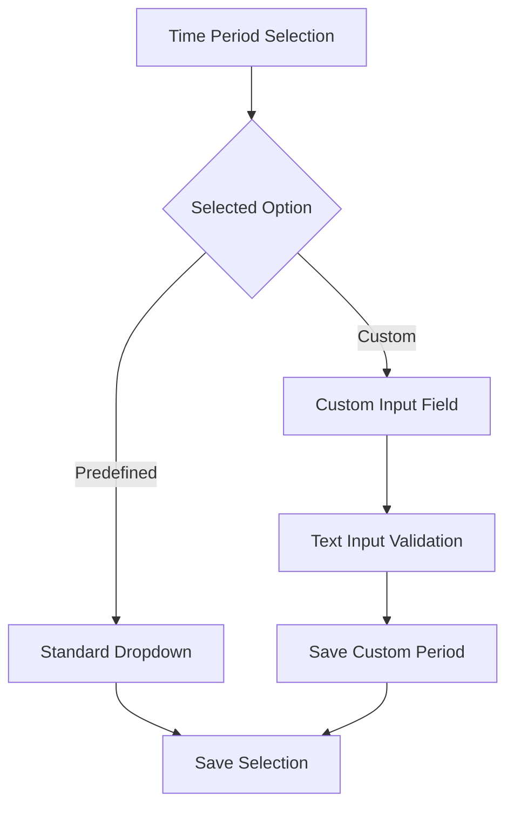
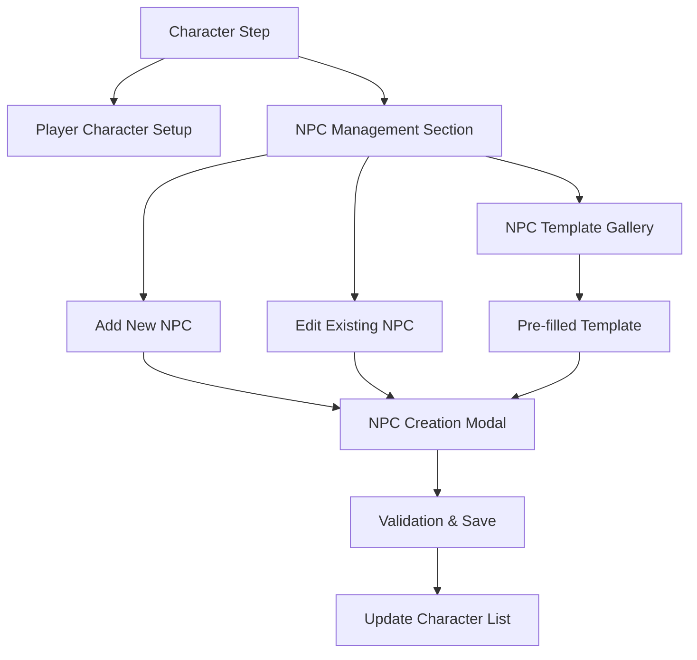
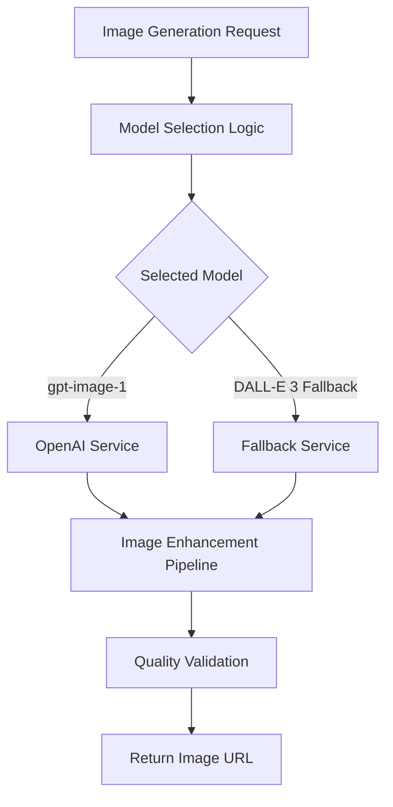
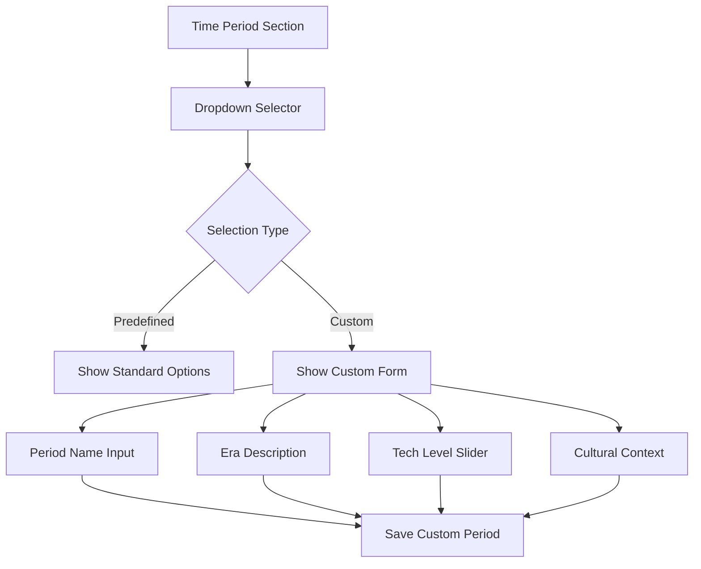

# AI Dungeon Adventure Creation Enhancements

## Overview

This design addresses three critical improvements to the AI Dungeon custom adventure creation system:

1. **Custom Time Period Input**: Enable users to specify and input custom time periods beyond predefined options
2. **Enhanced NPC Management**: Improve the NPC creation workflow and integration 
3. **Image Generation Model Upgrade**: Replace DALL-E 3 with gpt-image-1, the newest AI image generation model

## Architecture

### Frontend Component Enhancements

#### Custom Time Period Selection
The current `SettingStep` component only supports predefined time periods from a dropdown. This enhancement adds custom time period input capability.



**Implementation Components:**
- Modified `SettingStep.tsx` with conditional rendering
- Custom time period input field with validation
- State management for custom period values
- UI feedback for custom vs predefined selections

#### Enhanced NPC Character Creation
Current NPC creation modal exists but could benefit from workflow improvements and better integration.



**Enhancement Areas:**
- NPC template gallery for common character types
- Relationship mapping between NPCs
- Character trait suggestions
- Visual NPC card improvements
- Batch import/export functionality

### Backend Service Modifications

#### Image Generation Service Upgrade
Current implementation uses DALL-E 3. We need to upgrade to gpt-image-1, the newest image generation model, with enhanced configuration options.



**Current OpenAI Service Structure:**
- Model: `dall-e-3`
- Size: `1024x1024` 
- Quality: `standard`
- Enhanced prompt engineering

**Proposed Upgrade to gpt-image-1:**
- Primary model: `gpt-image-1`
- Enhanced quality and generation speed
- Improved prompt understanding
- Better contextual image generation
- DALL-E 3 fallback for compatibility
- Dynamic model selection configuration

## Data Models & State Management

### Custom Time Period Data Structure

```typescript
interface TimePeriodSelection {
  type: 'predefined' | 'custom';
  value: string;
  customDescription?: string;
  era?: string;
  technologicalLevel?: string;
  culturalContext?: string;
}

interface AdventureSetting {
  world_description: string;
  time_period: TimePeriodSelection;
  environment: string;
  special_rules?: string;
  locations: string[];
}
```

### Enhanced NPC Data Model

```typescript
interface EnhancedNPC {
  id: string;
  name: string;
  description: string;
  relationship: string;
  personality?: string;
  goals?: string;
  traits: string[];
  backstory?: string;
  importance: 'major' | 'minor' | 'background';
  templateId?: string;
  relationships: NPCRelationship[];
}

interface NPCRelationship {
  targetNpcId: string;
  type: 'ally' | 'enemy' | 'neutral' | 'family' | 'romantic' | 'rival';
  description: string;
  strength: number; // 1-10
}
```

### Image Generation Configuration

```typescript
interface ImageGenerationConfig {
  model: 'gpt-image-1' | 'dall-e-3' | 'dall-e-2';
  size: '256x256' | '512x512' | '1024x1024' | '1792x1024' | '1024x1792';
  quality: 'standard' | 'hd';
  style?: 'vivid' | 'natural';
  enhancementLevel: 'basic' | 'detailed' | 'artistic';
  fallbackModel?: 'dall-e-3' | 'dall-e-2';
}

interface EnhancedImageRequest {
  prompt: string;
  adventureContext: AdventureDetails;
  config: ImageGenerationConfig;
  fallbackEnabled: boolean;
}
```

## API Endpoint Modifications

### Custom Adventure Validation Enhancement

**Modified Request Schema:**
```json
{
  "adventure_details": {
    "setting": {
      "time_period": {
        "type": "custom",
        "value": "Post-Digital Collapse Era",
        "customDescription": "Year 2157, 50 years after the Great Network Shutdown",
        "technologicalLevel": "Pre-digital with salvaged tech",
        "culturalContext": "Neo-tribal societies with tech artifacts"
      }
    },
    "characters": {
      "key_npcs": [
        {
          "id": "npc_001",
          "name": "Marcus the Datascraper",
          "importance": "major",
          "traits": ["tech-savvy", "paranoid", "protective"],
          "relationships": [
            {
              "targetNpcId": "npc_002", 
              "type": "ally",
              "strength": 8
            }
          ]
        }
      ]
    }
  },
  "image_config": {
    "model": "gpt-image-1",
    "quality": "hd",
    "style": "vivid",
    "fallbackModel": "dall-e-3"
  }
}
```

### Image Generation Endpoint Enhancement

**New Endpoint:** `POST /api/generate-image-enhanced`

```json
{
  "prompt": "A post-apocalyptic marketplace scene",
  "adventure_context": {
    "time_period": "custom_post_digital",
    "atmosphere": "gritty_realistic",
    "key_elements": ["salvaged_tech", "tribal_clothing", "urban_ruins"]
  },
  "config": {
    "model": "gpt-image-1",
    "size": "1024x1024",
    "quality": "hd",
    "style": "vivid",
    "fallbackModel": "dall-e-3"
  }
}
```

## Frontend UI/UX Design

### Custom Time Period Interface



**Custom Time Period Form Fields:**
- Period Name (required)
- Detailed Description
- Technological Level (slider: primitive → advanced)
- Cultural Context (freeform text)
- Example Time Periods (suggestions)

### Enhanced NPC Management Interface

**NPC Creation Workflow:**
1. **Template Selection** - Choose from common archetypes
2. **Basic Information** - Name, appearance, role
3. **Personality Builder** - Trait selection with descriptions
4. **Relationship Mapping** - Connect to other NPCs
5. **Backstory Generation** - AI-assisted or manual
6. **Review & Refinement** - Preview and edit

**NPC Template Gallery:**
- **Classic Fantasy**: Wizard, Rogue, Paladin, Merchant
- **Sci-Fi**: Captain, Engineer, Android, Alien Diplomat  
- **Modern**: Detective, Hacker, CEO, Journalist
- **Horror**: Survivor, Cultist, Investigator, Entity
- **Custom**: User-created templates

## Testing Strategy

### Custom Time Period Testing
- Validation of custom time period inputs
- Integration with adventure generation
- State persistence across wizard steps
- Edge cases (very long descriptions, special characters)

### Enhanced NPC Testing  
- NPC creation and editing workflows
- Relationship mapping functionality
- Template system integration
- Data validation and limits

### Image Generation Testing
- Model selection and configuration
- Quality comparison between settings
- Fallback mechanism validation
- Custom adventure context integration

## Technical Implementation Notes

### State Management Updates

**Custom Adventure Slice Modifications:**
```typescript
// Add to customAdventureSlice.ts
interface CustomTimePeriod {
  type: 'predefined' | 'custom';
  value: string;
  description?: string;
  era?: string;
  techLevel?: number;
  culturalContext?: string;
}

// New actions
updateTimePeriod: (state, action: PayloadAction<CustomTimePeriod>) => {
  if (state.currentAdventure?.setting) {
    state.currentAdventure.setting.time_period = action.payload;
  }
},

addNPCRelationship: (state, action: PayloadAction<{npcId: string, relationship: NPCRelationship}>) => {
  // Implementation for NPC relationship management
},
```

### Backend Service Enhancements

**OpenAI Service Updates:**
```typescript
class OpenAIService {
  async generateImageEnhanced(
    prompt: string, 
    config: ImageGenerationConfig,
    adventureContext?: AdventureDetails
  ): Promise<string> {
    const enhancedPrompt = this.buildContextualPrompt(prompt, adventureContext);
    
    try {
      // Try gpt-image-1 first
      const response = await axios.post(`${this.baseURL}/images/generations`, {
        model: config.model, // gpt-image-1
        prompt: enhancedPrompt,
        size: config.size,
        quality: config.quality,
        style: config.style,
        n: 1,
      });
      
      return response.data.data[0].url;
    } catch (error) {
      // Fallback to DALL-E 3 if gpt-image-1 fails
      if (config.fallbackModel) {
        const fallbackResponse = await axios.post(`${this.baseURL}/images/generations`, {
          model: config.fallbackModel,
          prompt: enhancedPrompt,
          size: config.size,
          quality: config.quality,
          style: config.style,
          n: 1,
        });
        
        return fallbackResponse.data.data[0].url;
      }
      throw error;
    }
  }
  
  private buildContextualPrompt(
    basePrompt: string, 
    context?: AdventureDetails
  ): string {
    if (!context) return basePrompt;
    
    let enhancedPrompt = basePrompt;
    
    // Add time period context
    if (context.setting.time_period.type === 'custom') {
      enhancedPrompt += `, set in ${context.setting.time_period.description}`;
    }
    
    // Add style and atmosphere
    enhancedPrompt += `, ${context.style_preferences.tone} atmosphere`;
    
    return enhancedPrompt;
  }
}
```

## Migration Strategy

### Phase 1: Custom Time Period Implementation
1. Update frontend `SettingStep` component
2. Modify state management for time period handling
3. Update backend validation for custom time periods
4. Test integration with existing adventure creation

### Phase 2: Enhanced NPC Management  
1. Create NPC template system
2. Implement relationship mapping
3. Enhanced NPC creation modal
4. Batch operations and import/export

### Phase 3: Image Generation Enhancement
1. Upgrade to gpt-image-1 as primary model
2. Configure DALL-E 3 fallback mechanism
3. Implement contextual prompt building
4. Add quality and style options
5. Test and optimize image generation pipeline

## Security Considerations

### Input Validation
- Sanitize custom time period descriptions
- Validate NPC relationship data integrity  
- Prevent malicious prompt injection in image generation

### Rate Limiting
- Enhanced rate limiting for image generation with higher quality settings
- NPC creation limits per user session
- Custom time period storage limits

### Data Privacy
- Secure storage of custom adventure templates
- User-created NPC template privacy controls
- Image generation prompt audit logging