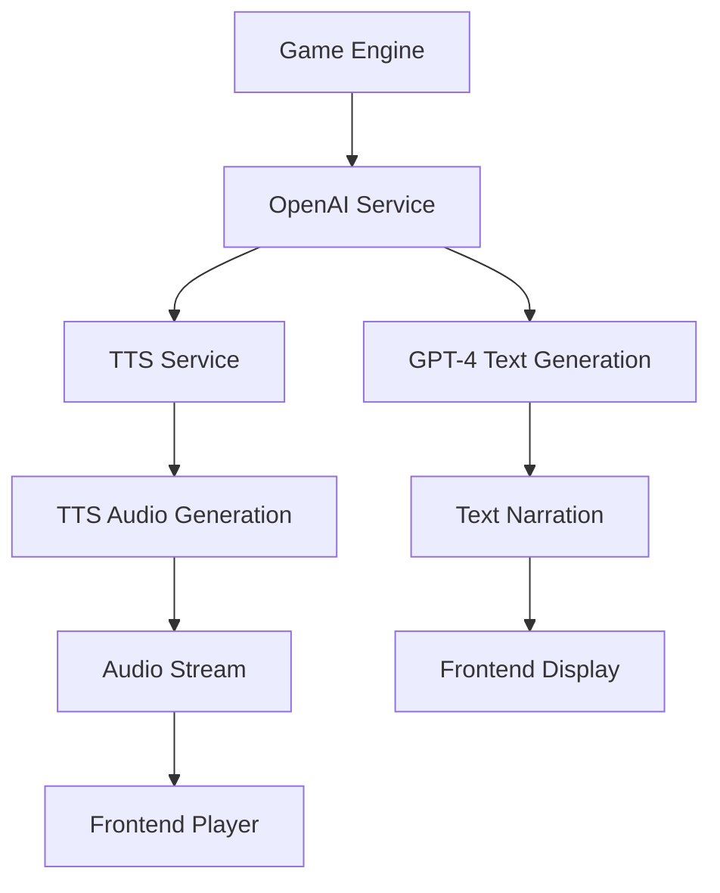
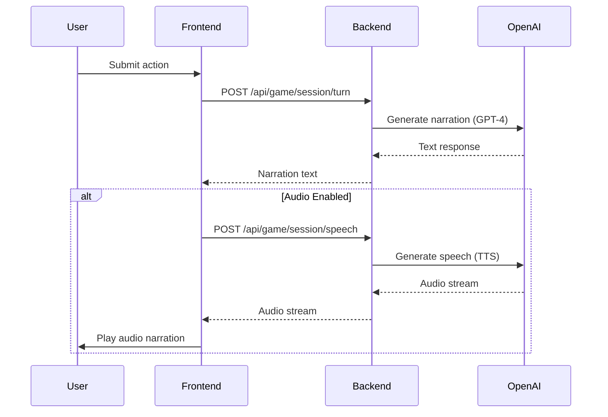
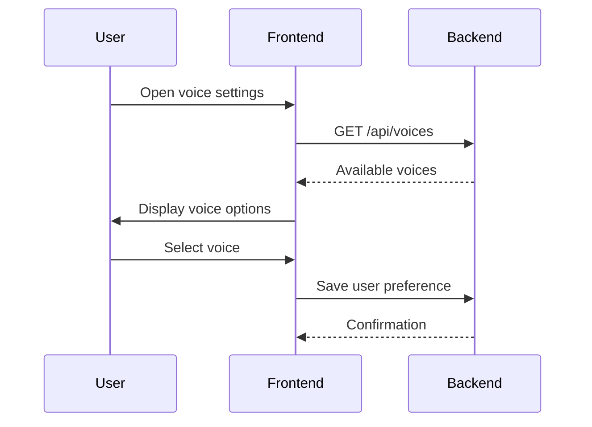

# OpenAI TTS Integration for Story Narration

## Overview
This document outlines the design for integrating OpenAI's Text-to-Speech (TTS) capabilities into the AI Dungeon application to provide audio narration for story content. This feature will enhance the user experience by allowing players to listen to the story narration instead of just reading it.

## Architecture

### Current System Context
The existing system uses OpenAI's GPT models for generating text-based story narration through the `openAIService.ts` module. The narration is displayed in the frontend via the `MobileOptimizedChat.tsx` component.

### Proposed TTS Integration
The TTS functionality will be implemented as an extension to the existing `openAIService.ts` module, with new frontend components to handle audio playback.



## Backend Implementation

### 1. OpenAI Service Extension
Extend the existing `openAIService.ts` to include TTS capabilities:

#### New Methods
- `generateSpeech(text: string, voice: string, speed: number): Promise<Buffer>`
- `getAvailableVoices(): string[]`
- `validateTTSRequest(text: string): boolean`

#### TTS Configuration
```typescript
interface TTSConfig {
  model: 'tts-1' | 'tts-1-hd';
  voice: 'alloy' | 'echo' | 'fable' | 'onyx' | 'nova' | 'shimmer';
  speed: number; // 0.25 - 4.0
  response_format: 'mp3' | 'opus' | 'aac' | 'flac';
}
```

### 2. API Endpoints
Add new endpoints to the game routes:

#### Generate Speech Endpoint
```
POST /api/game/:sessionId/speech
Content-Type: application/json

{
  "text": "Your story narration text here",
  "voice": "fable",
  "speed": 1.0,
  "quality": "high"
}
```

Response:
```
200 OK
Content-Type: audio/mpeg

[Audio stream]
```

#### Available Voices Endpoint
```
GET /api/voices
```

Response:
```
200 OK
Content-Type: application/json

{
  "voices": [
    {"id": "alloy", "name": "Alloy", "gender": "neutral"},
    {"id": "echo", "name": "Echo", "gender": "male"},
    {"id": "fable", "name": "Fable", "gender": "male"},
    {"id": "onyx", "name": "Onyx", "gender": "male"},
    {"id": "nova", "name": "Nova", "gender": "female"},
    {"id": "shimmer", "name": "Shimmer", "gender": "female"}
  ]
}
```

## Frontend Implementation

### 1. Audio Player Component
Create a new `AudioPlayer.tsx` component:

#### Features
- Play/Pause controls
- Volume control
- Progress bar
- Voice selection
- Speed control

#### Props Interface
```typescript
interface AudioPlayerProps {
  sessionId: string;
  narrationText: string;
  onPlaybackComplete: () => void;
  onError: (error: string) => void;
}
```

### 2. Integration with Game Screen
Modify `GameScreen.tsx` to include audio playback capabilities:

#### UI Enhancements
- Add audio playback toggle button
- Add voice selection dropdown
- Add audio controls panel (collapsible)

#### State Management
Add new state properties to `gameSlice.ts`:
```typescript
interface GameAudioState {
  isAudioEnabled: boolean;
  selectedVoice: string;
  playbackSpeed: number;
  isPlaying: boolean;
  currentTime: number;
  duration: number;
}
```

## Data Flow

### 1. Text Generation with Audio Option


### 2. Voice Selection Flow


## Business Logic

### 1. Audio Generation Service
Implement a service that:
- Takes narration text as input
- Validates text length (max 4096 characters)
- Applies text preprocessing for better audio quality
- Calls OpenAI TTS API with appropriate parameters
- Handles errors and fallbacks

### 2. Audio Caching Strategy
To optimize performance and reduce API costs:
- Cache generated audio files using Redis
- Use session ID and text hash as cache key
- Implement cache expiration (24 hours)
- Serve cached audio when available

### 3. Quality Options
Support different quality levels:
- Standard: `tts-1` model with MP3 format
- High Quality: `tts-1-hd` model with FLAC format

## Middleware & Error Handling

### 1. Rate Limiting
Implement rate limiting for TTS requests:
- Max 50 requests per minute per user
- Return 429 status when limit exceeded

### 2. Error Handling
Handle various error scenarios:
- TTS API failures (fallback to text-only)
- Invalid text input (validation errors)
- Audio playback errors (browser compatibility)
- Network issues (retry mechanism)

### 3. Content Moderation
Apply existing content moderation to TTS requests:
- Validate text before sending to TTS API
- Prevent generation of inappropriate audio content

## Testing Strategy

### Unit Tests

#### Backend Tests
1. TTS Service Tests
   - Text validation
   - API call formatting
   - Error handling
   - Caching mechanism

2. API Endpoint Tests
   - Speech generation endpoint
   - Voice listing endpoint
   - Authentication requirements

#### Frontend Tests
1. Audio Player Component Tests
   - Play/pause functionality
   - Volume control
   - Progress tracking
   - Error handling

2. Integration Tests
   - Audio generation flow
   - Voice selection persistence
   - Playback state management

### Integration Tests
1. End-to-end TTS flow
2. Caching mechanism verification
3. Error recovery scenarios

## Security Considerations

### 1. API Key Protection
- Keep OpenAI API key in backend environment variables
- Do not expose keys to frontend

### 2. Input Validation
- Validate all text inputs before TTS processing
- Limit text length to prevent abuse
- Apply content moderation

### 3. Rate Limiting
- Implement per-user rate limits
- Prevent denial of service attacks

## Performance Considerations

### 1. Caching
- Cache generated audio files
- Use efficient cache key strategy
- Implement cache eviction policy

### 2. Streaming
- Stream audio directly to client
- Avoid buffering entire audio files in memory
- Support progressive playback

### 3. Preprocessing
- Optimize text for better TTS quality
- Handle special characters and formatting
- Split long texts into manageable chunks

## Future Enhancements

### 1. Multi-language Support
- Support for different language voices
- Automatic language detection
- Language-specific pronunciation rules

### 2. Custom Voice Models
- Support for fine-tuned voice models
- Character-specific voices
- User voice preferences

### 3. Emotion and Tone Control
- API parameters for emotional tone
- Context-aware voice modulation
- Dynamic voice adjustments based on story content