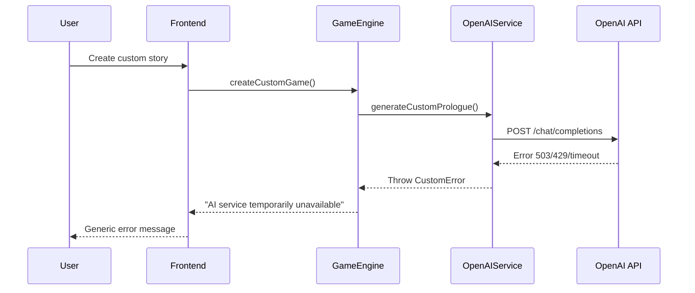
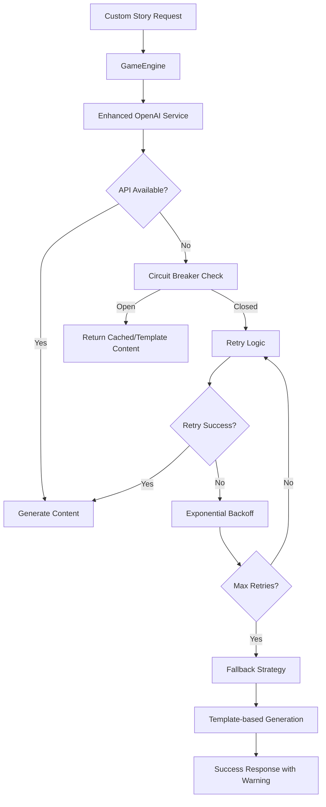
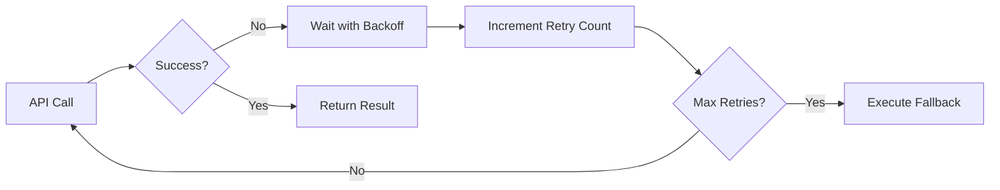
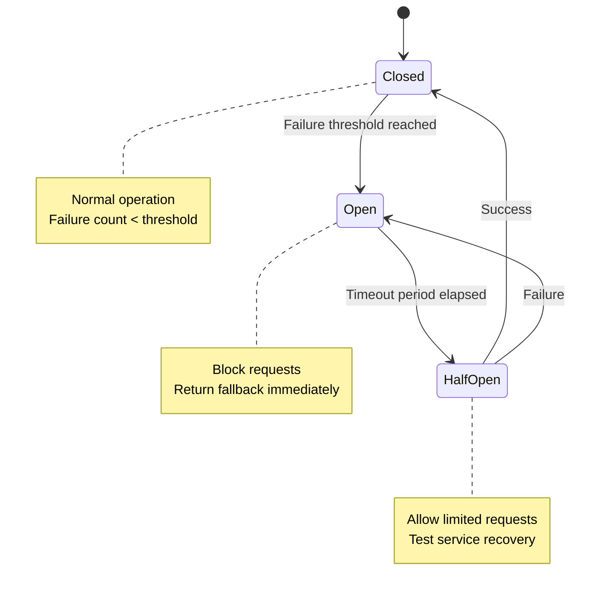
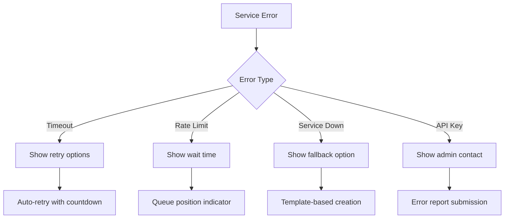
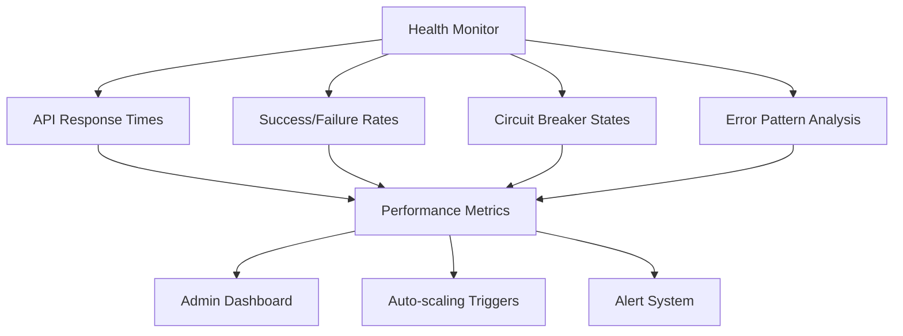
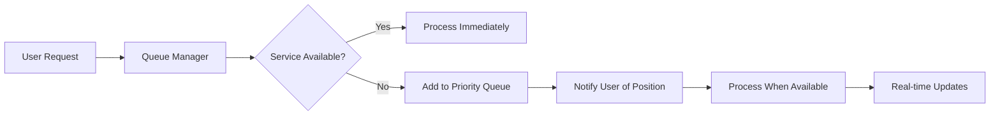
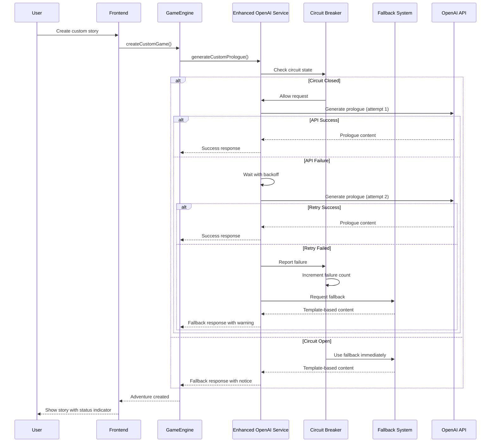
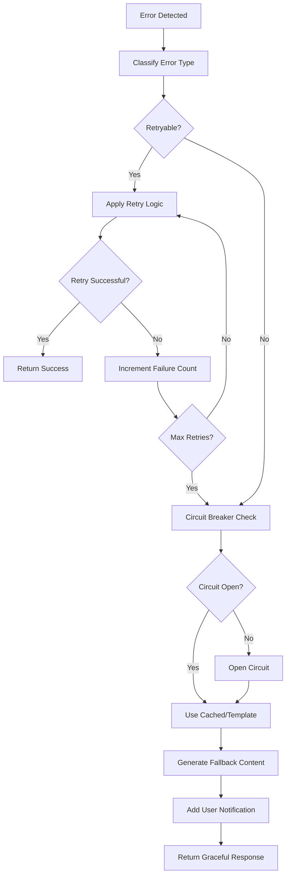

# AI Service Reliability Enhancement for Custom Story Creation

## Overview

This design addresses the "AI service temporarily unavailable" error that occurs during custom story creation in AI Dungeon. The issue stems from insufficient error handling, retry mechanisms, and fallback strategies when the OpenAI API becomes temporarily unavailable or returns errors during the custom adventure creation process.

## Current System Analysis

### Problem Areas Identified

The current implementation in `OpenAIService` and `GameEngine` has several reliability gaps:

1. **Single-point failure**: No retry logic for transient OpenAI API failures
2. **Limited error context**: Generic "AI service temporarily unavailable" message 
3. **No graceful degradation**: Service fails completely when AI is unavailable
4. **Insufficient timeout handling**: Fixed timeouts without adaptive behavior
5. **Missing circuit breaker pattern**: No protection against cascading failures

### Current Error Flow



## Architecture Design

### Enhanced Error Handling Framework



### Service Reliability Components

#### 1. Retry Mechanism with Exponential Backoff



**Retry Strategy:**
- Initial delay: 1000ms
- Maximum delay: 30000ms  
- Backoff multiplier: 2.0
- Maximum attempts: 3
- Jitter: ±200ms to prevent thundering herd

#### 2. Circuit Breaker Pattern



**Circuit Breaker Configuration:**
- Failure threshold: 5 consecutive failures
- Timeout period: 60 seconds
- Half-open success threshold: 2 successful requests
- Monitoring window: 5 minutes

#### 3. Fallback Content Generation

When AI service is unavailable, the system generates adventure prologues using:

**Template-Based Generation:**
- Pre-defined story templates by genre/setting
- Dynamic substitution with user-provided details
- Structured narrative templates with placeholders

**Template Structure:**
```
{
  "narration": "Template text with {{character_role}} and {{setting}} placeholders",
  "image_prompt": "Generic scene description based on {{environment}}",
  "quick_actions": ["Context-appropriate actions based on {{adventure_type}}"],
  "state_changes": {"location": "{{starting_location}}", "flags": {"template_used": true}}
}
```

### Enhanced User Experience Design

#### Progressive Error Communication



#### User Interface Enhancements

**Loading States:**
- Animated spinner with descriptive messages
- Progress indicators for multi-step generation
- Estimated completion times
- Retry countdown timers

**Error Recovery Options:**
- "Try Again" button with intelligent retry
- "Use Template" option for immediate play
- "Save Draft" to preserve user input
- "Get Notified" when service recovers

## Implementation Strategy

### Phase 1: Core Reliability Infrastructure

#### Enhanced OpenAI Service Architecture

```typescript
interface RetryConfig {
  maxAttempts: number;
  initialDelay: number;
  maxDelay: number;
  backoffMultiplier: number;
  jitterRange: number;
}

interface CircuitBreakerConfig {
  failureThreshold: number;
  timeoutMs: number;
  halfOpenMaxRequests: number;
  monitoringWindowMs: number;
}

interface FallbackConfig {
  templates: AdventureTemplate[];
  placeholderImages: string[];
  defaultActions: string[];
}
```

#### Service Health Monitoring



### Phase 2: Fallback Content System

#### Template Management

**Adventure Templates by Category:**
- Fantasy: Medieval, High Fantasy, Dark Fantasy
- Sci-Fi: Space Opera, Cyberpunk, Post-Apocalyptic  
- Horror: Gothic, Psychological, Cosmic
- Modern: Thriller, Mystery, Adventure

**Dynamic Content Injection:**
- Character role adaptation
- Setting description integration
- Plot objective alignment
- Tone/style matching

### Phase 3: User Experience Optimization

#### Proactive Error Prevention

**Pre-flight Checks:**
- API availability testing before story creation
- Rate limit status verification
- Service health assessment
- Optimal request timing

#### Intelligent Queueing System



## Data Flow Architecture

### Enhanced Custom Story Creation Flow



### Error Recovery Workflow



## Testing Strategy

### Reliability Testing Framework

#### Chaos Engineering Tests

**Service Disruption Scenarios:**
- Random API timeouts (10-60 seconds)
- Intermittent 503 service unavailable
- Rate limiting (429) responses  
- Network connectivity issues
- Partial response corruption

#### Circuit Breaker Validation

**Test Cases:**
- Failure threshold triggering
- Recovery behavior validation
- Half-open state transitions
- Performance under circuit protection

#### Fallback Content Quality

**Template Validation:**
- Narrative coherence assessment
- User satisfaction metrics
- Adventure progression testing
- Character consistency verification

### Performance Testing

**Load Scenarios:**
- Concurrent custom story creation (100+ users)
- API service degradation simulation
- Recovery time measurement
- Fallback system throughput testing

## Monitoring and Observability

### Service Health Dashboard

**Key Metrics:**
- API response times (P50, P95, P99)
- Success/failure rates by endpoint
- Circuit breaker state changes
- Fallback usage frequency
- User experience impact scores

### Alert Configuration

**Critical Alerts:**
- Circuit breaker opened
- API failure rate >10%
- Response time >30 seconds
- Fallback usage >50%

**Warning Alerts:**
- Response time >15 seconds
- Failure rate >5%
- Queue depth >20 requests
- Template usage >25%

## Security Considerations

### Fallback Content Security

**Template Validation:**
- Input sanitization for user data
- Content moderation for generated text
- XSS prevention in dynamic substitution
- Rate limiting on fallback requests

### Error Information Disclosure

**Safe Error Messages:**
- Generic user-facing error text
- Detailed logging for internal use only
- No API key or service details exposed
- Sanitized error context sharing

## Deployment Strategy

### Rollout Plan

**Phase 1: Core Infrastructure (Week 1-2)**
- Implement retry mechanism
- Add circuit breaker pattern
- Create basic fallback templates
- Deploy monitoring framework

**Phase 2: Enhanced Fallbacks (Week 3-4)**  
- Expand template library
- Implement dynamic content injection
- Add user notification system
- Optimize fallback quality

**Phase 3: User Experience (Week 5-6)**
- Implement progressive loading
- Add retry UI components
- Create status communication
- Performance optimization

### Feature Flags

**Gradual Feature Activation:**
- `enhanced_retry_logic`: Enable retry mechanism
- `circuit_breaker_enabled`: Activate circuit breaker  
- `fallback_templates`: Allow template-based generation
- `proactive_monitoring`: Enable health checks

## Success Metrics

### Reliability Improvements

**Target Metrics:**
- Custom story creation success rate: >95%
- Average error recovery time: <30 seconds
- User satisfaction with fallback content: >80%
- Service availability perception: >98%

### User Experience Enhancements

**Measurement Criteria:**
- Reduced user abandonment during errors
- Increased completion rate for custom stories
- Improved error communication clarity
- Faster issue resolution times